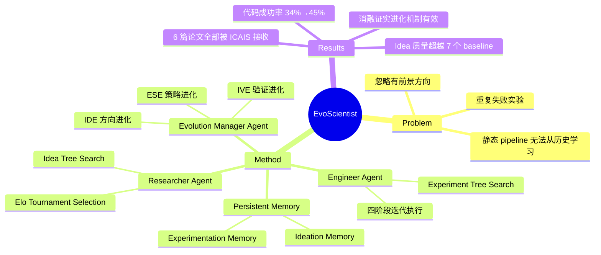

## Summary
提出 EvoScientist，一个自进化的多智能体框架，通过三个专用 agent（Researcher、Engineer、Evolution Manager）和两个持久记忆模块（Ideation Memory、Experimentation Memory），实现端到端科学发现中 idea 生成与代码执行策略的持续自我改进。

## Problem & Motivation
当前 AI scientist 系统依赖静态、手工设计的 pipeline，无法从历史交互中学习和适应。它们在 idea 生成和实验执行阶段会系统性地忽略有前景的方向、重复失败的实验、追求不可行的 idea。作者提出的核心问题是：如何将端到端科学发现建模为一个学习问题，使多智能体系统能从先前的成功和失败中进化其 idea 生成和代码生成策略？

## Method
EvoScientist 包含三个专用 agent 和两个持久记忆模块：

### 三个 Agent
1. **Researcher Agent (RA)**：负责科学 idea 生成和 research proposal 撰写
   - 使用 **Idea Tree Search**：每个树节点存储 idea 草稿和 review 反馈，通过扩展生成精炼的子 idea
   - 使用 **Tournament Idea Selection**（基于 Elo 排名）进行 pairwise comparison，保留 top-3 idea 用于方向总结，top-1 idea 扩展为结构化 proposal
   - 通过 embedding-based retrieval 从 Ideation Memory 中检索相关方向知识

2. **Engineer Agent (EA)**：负责实验实现和执行
   - 使用 **Experiment Tree Search**，分四个阶段迭代：initial implementation → hyperparameter tuning → proposed method → ablation
   - 每个阶段生成可执行代码、运行实验、记录结构化结果；失败时从日志诊断问题并修改代码
   - 从 Experimentation Memory 检索可复用的执行策略

3. **Evolution Manager Agent (EMA)**：负责从历史中蒸馏洞见到持久记忆
   - **Idea Direction Evolution (IDE)**：从 top-ranked ideas 总结有前景的研究方向
   - **Idea Validation Evolution (IVE)**：分析执行报告，将失败方向记录为不成功方向
   - **Experiment Strategy Evolution (ESE)**：从 code search trajectories 蒸馏可复用的数据处理和模型训练策略

### 两个持久记忆模块
- **Ideation Memory (M_I)**：存储可行研究方向摘要 + 历史失败方向记录
- **Experimentation Memory (M_E)**：存储有效的数据处理和模型训练策略

## Key Results
**Idea 生成（RQ1）**：
- 自动评估中，相较 open-source baseline 的平均性能差距为 +29.17 到 +93.34；相较 commercial 系统为 +46.00 到 +80.83
- 人工评估中，novelty win rate 达 82.50%，feasibility win rate 达 64.17%

**代码生成（RQ2）**：
- 进化前平均执行成功率 34.39%，进化后提升至 44.56%

**端到端科学发现（RQ3）**：
- 生成的 6 篇完整论文全部被 ICAIS 2025 接收（接收率 31.71%）
- 1 篇获 Best Paper Award，1 篇获 AI Reviewer's Appraisal Award

**消融实验（RQ4）**：
- 移除 IDE 后 novelty lose rate 达 66.67%
- 移除 IVE 后 feasibility lose rate 达 63.33%
- 移除所有 idea evolution 后 novelty/feasibility lose rate 分别达 80%/83.33%
- 进化机制主要提升 originality 和 feasibility，对 relevance/clarity 影响较小

## Strengths & Weaknesses
**Strengths**：
- 首次将端到端科学发现建模为可学习问题，提出三种自进化机制（IDE、IVE、ESE），使系统能从历史中持续改进
- 实验充分：同时覆盖 idea generation、code execution、end-to-end discovery 三个维度，且有真实学术会议的接收结果验证
- Idea Tree Search + Elo-based Tournament Selection 的组合设计合理，有效提升 idea 质量

**Weaknesses**：
- 评估仅限计算类研究任务（可通过模拟和代码执行验证），能否泛化到需要物理实验的领域（材料科学、药物发现）尚未验证
- ICAIS 2025 作为验证场景的说服力有限，需在更高影响力的 venue 进一步验证
- 论文未开源代码，可复现性存疑
- 系统偏向经验性发现（"the what"），缺乏更深层的理论化能力（"the why"）

## Mind Map

## Notes
