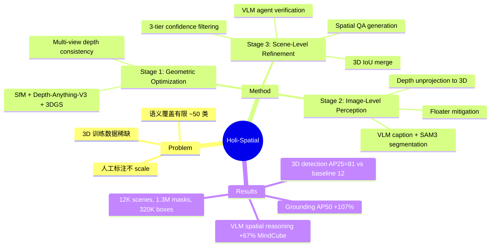

## Summary

提出 Holi-Spatial，一个全自动的从原始视频构建大规模 3D 空间标注数据的 pipeline，通过 3DGS + VLM + SAM3 的级联系统生成 12K 场景、1.3M 2D masks、320K 3D bounding boxes 和 1.2M spatial QA pairs，用于提升 VLM 的空间推理能力。

## Problem & Motivation

当前 multimodal model 的 spatial intelligence 远落后于 2D 能力，核心瓶颈是**3D 训练数据稀缺且不均衡**。现有数据集（ScanNet、ScanNet++）依赖专用 3D 扫描硬件和人工标注，语义覆盖有限（~50 类），难以 scale。作者认为应该用 AI 工具链替代人工标注，将原始视频自动转化为高质量 3D 空间标注数据，实现 data flywheel。

## Method

三阶段 pipeline：

### Stage 1: Geometric Optimization
- SfM 恢复 camera intrinsics/extrinsics
- Depth-Anything-V3 生成初始 dense point cloud
- 3DGS 优化 + geometric regularization 确保 multi-view depth consistency，消除 floaters
- 输出：干净的、物理合理的场景表示

### Stage 2: Image-Level Perception
- 均匀采样 keyframes，维护 **dynamic class-label memory** 保持跨帧语义一致性
- Gemini3-Pro VLM 生成 frame captions
- SAM3 做 open-vocabulary instance segmentation（VLM-guided prompts）
- 2D masks 通过 depth 反投影到 3D：$P = D_t(u) \cdot K^{-1} \cdot \tilde{u}$
- **Depth floater mitigation**：mask boundary erosion + mesh-guided depth filtering 去除边缘伪影
- 初始 3D OBB 生成 + gravity alignment（检测 floor plane 重定向垂直轴）

### Stage 3: Scene-Level Refinement
- **Multi-view merge**：3D IoU clustering（$\tau_{merge}=0.2$，same category + IoU > 0.2），保留最高 confidence 的 source view
- **三级 confidence filtering**：
  - Keep: $s_k \geq 0.9$
  - Discard: $s_k < 0.8$
  - Verify: $0.8 \leq s_k < 0.9$（VLM agent + SAM3 re-segmentation 复审）
- **Dense annotation generation**：Qwen3-VL-30B 生成 fine-grained captions；从预定义模板生成 spatial QA pairs（camera rotation/movement、object distance、directional reasoning、size measurement）

### 数据集 Holi-Spatial-4M
- 来源视频：ScanNet + ScanNet++ + DL3DV-10K
- 输出规模：12K 3DGS 场景、1.3M 2D masks、320K 3D boxes、320K instance captions、1.2M 3D grounding pairs、1.25M spatial QA pairs

## Key Results

**Pipeline 质量评估（ScanNet++ 上）：**
- Depth estimation F1: **0.89** vs M3-Spatial 0.39（2.3× 提升）
- 2D segmentation IoU: **0.64** vs SA2VA 0.25（2.6× 提升）
- 3D detection: AP25=**81.06**, AP50=**70.05** vs LLaVA-3D AP25=12.2（6.5× 提升）

**VLM fine-tuning 效果：**
- Qwen3-VL-8B + Holi-Spatial: MMSI-Bench 31.1→**32.6**, MindCube 29.4→**49.1**（+67%）
- 3D grounding AP50: 13.50→**27.98**（+107%），超越 VST-7B-SFT 16.78 个点

**Ablation 亮点：**
- 3DGS training 使 Precision@25 从 0.13→0.81，消除 ghosting
- Confidence filtering + Agent verification 协同：precision 0.35→0.67，recall 保持 0.89

## Strengths & Weaknesses

**Strengths:**
- **Scalability 思路正确**：用 AI pipeline 替代人工标注，理论上可无限扩展到任何视频源，这是一个重要的 paradigm shift
- **工程完整度高**：三阶段 pipeline 每步都有针对性的 error mitigation（depth floater、confidence filtering、agent verification），系统设计细致
- **Hybrid verification 策略聪明**：三级 confidence threshold + VLM agent 复审，平衡 precision 和 recall，避免 hard threshold 的局限
- **数据量级可观**：12K 场景、1.2M+ 标注对，远超之前人工标注的规模

**Weaknesses:**
- **Pipeline 依赖链过长**：SfM → Depth-Anything-V3 → 3DGS → Gemini3-Pro → SAM3 → Qwen3-VL-30B，每个组件的 error 都会传播和累积，robustness 存疑
- **Compute cost 高**：per-scene 3DGS 优化 + 多次 VLM inference，计算成本是否真正优于人工标注需要更多讨论
- **视频源局限性**：核心来源仍是 ScanNet/ScanNet++/DL3DV-10K 这三个已有数据集的视频——都是受控环境下用特定设备拍摄的室内场景，并非真正的 in-the-wild 视频。虽然声称 "from raw video inputs"，但实际上丢弃了原有人工标注后用自动 pipeline 重标，视频本身的多样性并未扩展。Generalization 到更 challenging 的视频（手机随拍、动态物体、motion blur、严重遮挡）时 pipeline 可能退化
- **VLM downstream gain 有限**：MMSI-Bench 上仅 +1.5（31.1→32.6），spatial reasoning 的提升主要集中在 MindCube 和 grounding task，说明数据质量/多样性可能仍有瓶颈
- **缺少与其他自动标注 pipeline 的公平对比**：主要 baseline 是单组件方法，缺少与类似 end-to-end 自动标注系统（如果有的话）的对比

**对领域的影响：** 方向上有价值——用 foundation model 组合自动生成 3D 训练数据是趋势。但核心贡献更偏工程集成，methodological novelty 有限。关键问题是这种 pipeline 产生的数据能否持续 scale（更多视频→更好的 VLM），还是会遇到数据质量/多样性的天花板。

## Mind Map

## Notes

- 与 [[Papers/2401-SpatialVLM]] 的思路一脉相承——都是用自动 pipeline 生成 spatial reasoning 数据来训练 VLM，但 Holi-Spatial 扩展到了完整 3D 场景（3DGS + OBB），比 SpatialVLM 的 depth-based 方法更 holistic
- 与 [[Papers/2312-SplaTAM]] 的 3DGS SLAM 有技术关联，但 Holi-Spatial 是 offline pipeline 不追求实时
- Pipeline 的 "quality ceiling" 问题值得关注：当 upstream foundation model 改进（更好的 depth、segmentation、VLM），pipeline 输出会自动提升——这是 scalable 的信号
- 一个未回答的问题：自动标注数据的 noise pattern 是否与人工标注的 noise pattern 本质不同？如果是，VLM 可能学到的是 pipeline-specific bias 而非真正的 spatial understanding
