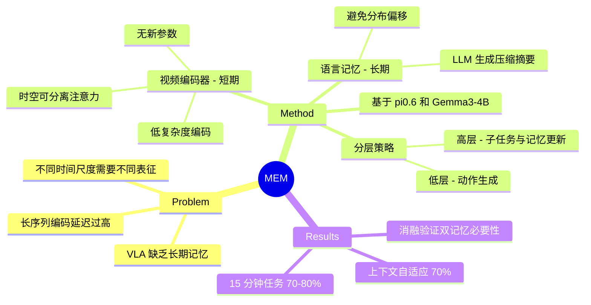

## Summary
MEM 提出了一种多尺度记忆架构，将**视频短期记忆**（通过高效视频编码器压缩）和**语言长期记忆**（自然语言事件摘要）结合，使 VLA 模型能够完成长达 15 分钟的复杂多阶段机器人任务（如厨房清理、三明治制作），同时满足实时推理延迟约束。

## Problem & Motivation
- 标准 VLA 仅基于当前观测生成动作，无法处理需要长时间记忆的多阶段任务
- 直接编码长观测序列计算上不可行（推理延迟过高）
- **核心洞察**：不同时间尺度需要不同的表征——近期事件（秒级）需要密集视觉细节以处理遮挡和精细控制；远期事件（分钟级）只需语义抽象（如"已完成哪些菜谱步骤"）
- 已有方法（仅本体感觉、点轨迹、关键帧选择）要么牺牲空间精度，要么牺牲时间理解

## Method
### 整体框架：分层策略
- **低层策略 π_LL**：基于近期 K 帧观测、子任务指令和目标生成动作序列
- **高层策略 π_HL**：生成子任务指令，并基于当前观测和历史记忆状态更新语言记忆

### A. 视频编码器（短期记忆）
- 扩展 ViT，加入**时空可分离注意力**：帧内双向空间注意力 + 帧间因果时间注意力
- 每 4 层交替空间层和时空注意力层
- 复杂度从 O(n²K²) 降至 O(Kn² + nK²)
- **不引入新的可学习参数**，直接从预训练 ViT 权重初始化
- 在深层丢弃过去帧的 token，保持恒定 token 数
- 可处理最多 54 秒的观测，推理延迟 <200ms（H100 GPU）

### B. 语言记忆（长期记忆）
- 维护 m_t：过去语义事件的自然语言摘要
- 高层策略通过当前观测更新 m_t → m_{t+1}
- **训练数据生成**：将带子任务标注的机器人 episode 传给预训练 LLM，由 LLM 压缩信息（如"放了三个碗"而非列举每个碗的颜色）
- 压缩减少 token 数，避免重复失败子任务导致的训练-推理分布偏移

### C. 基于 π_0.6 VLA 集成
- 基础模型初始化自 Gemma3-4B
- 修改视觉编码器支持视频输入
- 连续本体感觉嵌入（线性投影而非文本）
- 预训练数据混合：机器人演示、策略 rollout、视觉-语言任务、视频描述
- 训练时 6 帧（5 过去 + 当前），1 秒间隔；推理时可扩展到 18 帧 / 54 秒

## Key Results
### 长时间任务
| 任务 | 无记忆 | MEM |
|------|--------|-----|
| 菜谱准备（~15min） | ~10% | ~70-80% |
| 厨房清理 | ~5-10% | ~60-70% |

### 上下文自适应
- **筷子拾取（可变高度）**：MEM 在失败后调整抓取高度，~70% vs 无记忆 ~20%
- **冰箱开门**：MEM 学会在观察到失败后切换开门方向，~70% vs ~30%

### 对比实验
| 任务 | 无记忆 | Pool Memory | Proprio Memory | MEM |
|------|--------|-------------|----------------|-----|
| 三杯交换 | 25% | 40% | 25% | **85%** |
| 舀咖啡（2次） | 50% | 60% | 50% | **90%** |
| 找隐藏物体 | 25% | 70% | 25% | **95%** |

### 灵巧任务保持
MEM 在非记忆任务上与 π_0.6 基线性能持平，不降低原有能力。

### 消融实验
- 去掉视频记忆：成功率下降 30-40 点
- 去掉语言记忆：成功率下降 40-50 点
- 朴素语言记忆（拼接所有子任务指令不压缩）：下降 20-30 点
- 仅后训练引入记忆 vs 联合预训练：联合预训练显著更优

## Strengths & Weaknesses
**Strengths:**
- 多尺度记忆设计直觉清晰且有效，视频处理短期、语言处理长期，各取所长
- 视频编码器设计高效，不引入新参数，复用预训练权重
- 实验充分，涵盖长时间任务、上下文自适应、消融
- 15 分钟级任务完成是 VLA 领域的显著进步
- 在非记忆任务上不降低性能

**Weaknesses:**
- 语言记忆依赖 LLM 生成训练标签，质量受限于 LLM 能力
- 目前仅在 Physical Intelligence 的 π_0.6 上验证，通用性待验证
- 代码和模型未开源
- 语言记忆的更新频率和粒度如何确定未充分讨论

## Mind Map

## Notes
- 核心贡献在于将"记忆"问题分解为不同时间尺度，并用最适合的模态处理每个尺度
- 语言作为长期记忆的压缩表征是一个优雅的设计选择——语言天然是信息压缩的
- 预训练数据多样性（包括不同最优性、速度、控制频率的 episode）对防止虚假相关很重要
- Physical Intelligence (π) 团队的工作，作者阵容强大（Sergey Levine, Chelsea Finn, Danny Driess 等）
- 项目主页: https://pi.website/research/memory
