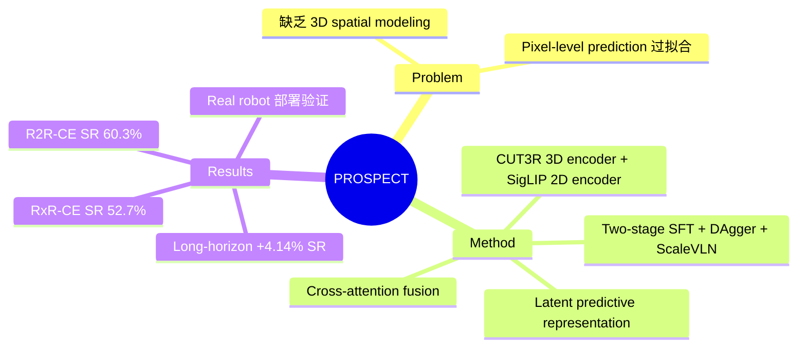

## Summary
PROSPECT 提出统一的 streaming VLN agent，通过 CUT3R (3D spatial) 和 SigLIP (2D semantic) 双编码器的 cross-attention fusion，结合 latent predictive representation learning（在 frozen teacher space 中预测下一步特征），在 VLN-CE benchmarks 和真实机器人上均取得强劲表现。

## Problem & Motivation
现有 VLN 方法面临两大局限：（1）缺乏对 3D spatial structure 的显式建模，导致 agent 在 continuous environments 中空间感知不足；（2）已有 predictive approaches 要么依赖 low-dimensional state-space models，要么在 explicit pixel space 中做 supervision，容易过拟合到与 navigation 无关的视觉细节。PROSPECT 将 spatial intelligence（CUT3R 提供绝对尺度 3D 特征）和 predictive learning（在冻结 teacher 的 latent space 中做预测）统一到一个 streaming VLA 框架中。

## Method
- **Dual encoder fusion**: 使用 CUT3R streaming 3D foundation encoder 提取 absolute-scale spatial features，SigLIP 提取 2D semantic features，通过 cross-attention 机制融合两种模态
- **Stream query tokens**: 引入 learnable stream query tokens，配合 streaming-causal attention mask，在训练时预测下一步的 latent features；推理时无额外开销
- **Latent predictive representation**: 两个轻量 Transformer decoder 分别在 frozen 2D（cosine distance）和 3D（MSE）teacher space 中做预测，损失函数为 L_all = L_nav + gamma(alpha * L_2D + beta * L_3D)，其中 gamma=0.01, alpha=0.25, beta=0.75
- **Two-stage training**: Stage 1 在 R2R/RxR/R2R-EnvDrop (~479K) 上 SFT；Stage 2 加入 DAgger (~260K)、ScaleVLN (~314K) 和 VQA 数据（LLaVA-Video, ScanQA），共 ~938K samples（71% VLN, 29% VQA）
- **Inference**: ~4 Hz，dual RTX-4090 约 0.25s/step

## Key Results
- **R2R-CE val-unseen**: SR 60.3%, SPL 52.0%, NE 5.31m（single-view RGB, MP3D+VideoQA setting）
- **RxR-CE val-unseen**: SR 52.7%, SPL 42.8%, NE 5.93m, nDTW 60.6%
- **Ablation**: 2D+3D 联合预测效果最佳（SR 48.7%, SPL 42.9%）；CUT3R 比 InfiniteVGGT 更快（0.245s vs 0.284s latency）
- **Long-horizon**: 在 >=100 步任务上 SR 提升 +4.14%，说明 predictive representation 对长程导航尤其有效
- **Real robot (ARX-Lift2)**: Office(Bright) 20/30, Corridor(Moderate) 22/30, Night Street(Low) 9/30，全面超越 NaVid 和 StreamVLN

## Strengths & Weaknesses
**Strengths**:
- 将 3D spatial intelligence（CUT3R）和 semantic understanding（SigLIP）优雅融合到 streaming 框架中，设计清晰
- Latent predictive learning 在 frozen teacher space 中进行，避免了 pixel-level 预测的过拟合问题，且推理时零额外开销
- 真实机器人实验覆盖室内外、不同光照条件，验证了 sim-to-real transfer 能力
- Long-horizon 性能提升显著，说明 predictive representation 对复杂导航任务有实际价值

**Weaknesses**:
- R2R-CE val-unseen SR 60.3% 虽然不错，但与同期 graph-based 方法（如 ETP-R1 的 65%）仍有差距，streaming VLA 在导航精度上仍有提升空间
- 依赖 CUT3R 这一特定 3D encoder，其泛化性和在 out-of-distribution 场景下的表现有待验证
- Real robot 夜间场景成功率较低（9/30），说明在极端条件下仍有局限
- 代码尚未开源，可复现性待观察

## Mind Map

## Notes
- PROSPECT 代表了 streaming VLA 路线在 VLN 中的最新进展，与 graph-based 路线（ETPNav/ETP-R1）形成互补
- 值得关注 latent prediction 在其他 embodied tasks（如 manipulation）中的应用潜力
