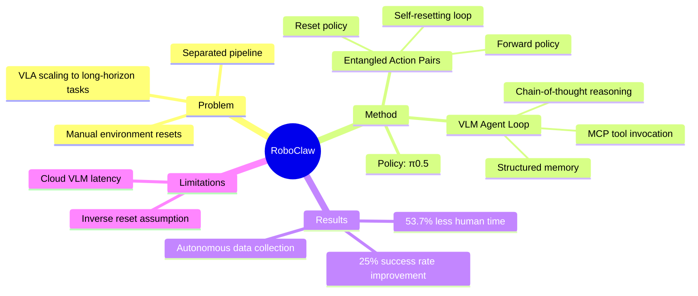

## Summary
RoboClaw 提出了一个统一的 agentic robotics 框架，通过 Entangled Action Pairs (EAP) 实现自主数据收集，并用 VLM 作为 meta-controller 统一数据收集、policy learning 和 task execution，在 long-horizon manipulation 任务上比 baseline 提升 25% 成功率，人工投入减少 53.7%。

## Problem & Motivation
现有 VLA 系统在 long-horizon 任务上面临挑战：数据收集、policy learning 和 deployment 通常是分离的 pipeline，严重依赖人工环境重置，且多 policy 执行脆弱。作者希望构建一个统一框架来解决这些问题。

## Method
核心包含两个创新：

**1. Entangled Action Pairs (EAP)**
- 对每个 policy k，同时学习 forward policy π₀.₅→（执行任务）和 reset policy π₀.₅←（恢复环境）
- 形成 self-resetting loop τₖ=(τₖ→, τₖ←)，环境自动回到初始状态，无需人工重置
- 支持持续 on-policy 数据采集和迭代 policy refinement

**2. VLM Agent Loop**
- 使用 off-the-shelf VLM 作为 meta-controller，通过 in-context learning 进行高层决策
- 维护 structured memory：role identity (rₜ)、task-level memory (gₜ)、working memory (wₜ)
- 每个 timestep：检索 memory + observations → chain-of-thought reasoning → 通过 MCP 接口调用 tools
- 底层 policy 使用 π0.5（VLA model），用 conditional flow matching 训练

**Deployment**：同一个 agent 进行高层推理并动态编排 learned policy primitives 来完成 long-horizon 任务。

## Key Results
- **数据收集效率**：相比人工 baseline，人工时间减少 2.16×，人工干预次数减少 8.04×
- **Subtask 成功率**（5 轮迭代后，/50 trials）：
  - Body Lotion: 21→43（+104%）
  - Primer: 23→40（+74%）
  - Lipstick: 2→23（+1050%）
  - Tissue Wipe: 11→26（+136%）
- **Long-horizon 任务**：成功率比 baseline 提升 25%，人工投入减少 53.7%
- 实验平台：Agibot G01 双臂机器人

## Strengths & Weaknesses
**Strengths:**
- 统一框架消除了数据收集/学习/执行之间的 semantic mismatch
- EAP 机制大幅降低人工负担，实现自主数据收集
- Closed-loop lifecycle：training 和 deployment 数据都可以用于持续学习
- 通过 MCP 接口调用 tools 的设计比较优雅

**Weaknesses:**
- 依赖 cloud-based VLM，存在 latency 问题
- 假设每个任务都存在可行的 inverse reset behavior，实际中不一定成立
- Lipstick 任务成功率仍然较低（23/50），精细操作仍有挑战

## Mind Map

## Notes
- 用 MCP 接口连接 VLM 和 robot tools 的设计思路值得参考
- EAP 的 self-resetting 思路可以推广到其他需要自主数据收集的场景
- 和 RL 中的 reset-free learning 有相似之处，但这里是通过显式学习 reset policy
