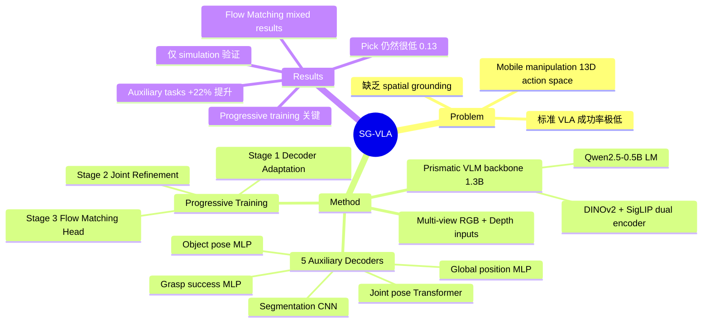

## Summary

SG-VLA 在 1.3B VLA 模型上引入 spatial grounding auxiliary decoders（robot position、joint pose、grasp、object pose、segmentation），配合 progressive training 策略，在 ManiSkill-HAB 家居 mobile manipulation 任务上将平均成功率从 0.60 提升至 0.73，展示了 auxiliary spatial supervision 对 VLA 在复杂 action space 下的显著增益。

## Problem & Motivation

Mobile manipulation 涉及 13 维 action space（3D base pose + 1D torso + 7D arm joints + 2D gripper），标准 VLA 通过 direct imitation learning 在家居任务上成功率很低（OpenVLA 仅 0.04）。核心挑战在于：(1) 单一 RGB 视角无法提供足够的空间信息；(2) VLM backbone 的 pre-trained representations 缺乏对 robot proprioception 和 3D spatial relationships 的理解；(3) 高维 action space 使得 behavior cloning 更加困难。现有 VLA 工作多聚焦于 tabletop manipulation，对 mobile manipulation 场景关注不足。

## Method

### Architecture

基于 Prismatic VLM backbone（1.3B），包含：
- **Dual visual encoder**: DINOv2（spatial understanding）+ SigLIP（semantic representations）
- **Language model**: Qwen2.5-0.5B
- **Trainable projector**: 映射 vision features 到 language embedding space

输入包括 multi-view RGB（head + hand cameras）、normalized depth maps（$p_{obs} = 1 - \tanh(\text{depth}/1000)$）和 natural language instructions。

### Auxiliary Decoders（核心贡献）

从 VLM 的 intermediate representations 接出五个 auxiliary decoders：

1. **Global Position Decoder**（MLP）: 预测 robot 2D 坐标 (x, y)
2. **Grasp Success Decoder**（MLP）: binary classification
3. **Object Pose Decoder**（MLP）: 7D（3D position + quaternion）
4. **Joint Pose Decoder**（Transformer）: 12D joint configuration，使用 mask tokens + multi-head self-attention 捕捉 kinematic structure
5. **Mask Decoder**（CNN）: 128×128 binary segmentation masks，四层 transpose convolution

Multi-task loss: $\mathcal{L}_{aux} = \lambda_{pos} \mathcal{L}_{pos} + \lambda_{grasp} \mathcal{L}_{grasp} + \lambda_{qpos} \mathcal{L}_{qpos} + \lambda_{obj} \mathcal{L}_{obj} + \lambda_{seg} \mathcal{L}_{seg}$

权重设置：$\lambda_{grasp}=5.0$，其余均为 1.0。

### Progressive Training（关键设计）

三阶段训练，解决 naive co-training 导致 15% 性能下降的问题：

- **Stage 1 (3 epochs)**: Decoder Adaptation — freeze VLM backbone 对 auxiliary decoders 的梯度，仅 discrete action token path 可更新 backbone。Decoders 在固定 representations 上学习。
- **Stage 2 (7 epochs)**: Joint Refinement — 打开全部梯度流，auxiliary losses 可回传到 VLM backbone，联合优化。
- **Stage 3**: Action Head Training — 完全冻结 VLM backbone，单独训练 Flow Matching action head（100M params），避免并发优化的收敛困难。

### Flow Matching Action Head（可选）

100M 参数的 action expert，生成 continuous 13D actions。用于替代 discrete action tokens，在精细 manipulation 上更有优势。

### 数据

ManiSkill-HAB benchmark：44K episodes, 1.4M transitions（simulation）。任务包括 TidyHouse（pick-and-place）、PrepareGroceries（pick-and-place）、SetTable（全部 4 类子任务）。

## Key Results

**Input modality ablation（平均成功率）**:
- OpenVLA（single RGB）: 0.04
- OpenVLA + multiview + depth: 0.32
- Base VLM + multiview + depth: **0.60**
- Base VLM + multiview + depth + history: 0.49（temporal history 反而降低性能）

**Auxiliary task ablation（with progressive training）**:
- Baseline（无 auxiliary）: 0.60
- + Joint position only: 0.71
- + All auxiliary combined: **0.73**（+22% over baseline）
- Naive co-training（无 progressive）: 0.51（-15%）

**Segmentation & Object Pose 的影响（pick-and-place 子任务平均）**: 0.27 → **0.47**

**任务细分**:
- Pick: 0.13 | Place: 0.70 | Fridge open: 0.87 | Drawer open: 0.77 | Fridge close: 0.90 | Drawer close: 1.00

**Flow Matching action head**: Pick 从 0.13 → 0.27（+107%），但 fridge/drawer open 下降，overall 0.73 → 0.69。

训练配置：8× A100 GPUs，batch size 512，learning rate 2e-5。

## Strengths & Weaknesses

**Strengths**:
- **Progressive training 策略设计合理**：解决了 auxiliary decoders 随机初始化与 pre-trained backbone 联合训练的矛盾，这个 insight 具有一般性价值
- **Auxiliary tasks 选择覆盖面广**：从 proprioception（joint pose）到 perception（segmentation、object pose）到 state estimation（position、grasp），形成较完整的 spatial grounding
- **实验 ablation 充分**：逐步 ablate input modalities、auxiliary tasks、training strategies，结论可信
- **Joint position decoder 的 Transformer 设计**有意思，利用 self-attention 建模 kinematic chain 的 dependencies

**Weaknesses**:
- **仅在 simulation 验证**：所有实验在 ManiSkill-HAB 上完成，未有 real-world transfer 验证。Sim-to-real gap 在 mobile manipulation 中尤为严重（depth noise、base odometry error 等）
- **Pick 成功率极低**（0.13，即使 Flow Matching 也只有 0.27）：这是 mobile manipulation 中最核心的能力，说明方法在精细 grasping 上仍有根本性不足
- **Temporal history 反而有害**（0.60 → 0.49）：论文解释为"tasks are sufficiently reactive"，但这回避了问题——家居任务显然需要 temporal reasoning（e.g., 记住已经 pick 了什么），更可能是 history 编码方式有问题
- **Auxiliary decoder 的标注来源不清晰**：simulation 中可以轻松获取 object pose、segmentation 等 ground truth，但 real-world 部署时这些 supervision signals 从何而来？这限制了方法的实际可扩展性
- **Action space 设计的局限**：13D action space 中 base 和 arm 是独立控制的，缺乏 whole-body coordination 的建模
- **Flow Matching 的 mixed results 令人担忧**：continuous actions 理论上应优于 discrete tokens，但在 open/close 任务上大幅退步（fridge open: 0.87 → 0.76），说明 Stage 3 的 frozen backbone + separate training 可能不是最优策略

**Hidden Assumptions**:
- 假设 VLM 的 intermediate features 已经编码了足够的 spatial information，auxiliary decoders 只是"读出"；但如果 backbone 本身缺乏 3D 理解能力，auxiliary supervision 的效果会受限
- 44K episodes 的数据规模在 VLA 领域偏小，方法能否 scale 到更大数据集和更多任务未知

## Mind Map

## Notes

- Progressive training 的思路值得借鉴：先让 auxiliary heads 适应 frozen backbone 的 feature space，再联合微调。这与 LoRA 等 parameter-efficient fine-tuning 的思路有类似之处——都是在管理 pre-trained knowledge 与 task-specific adaptation 之间的张力
- Pick 成功率如此低，说明 mobile manipulation 中的 grasping 问题远未解决。相比 tabletop setting，mobile base 的不确定性（positioning error、camera viewpoint 变化）给 grasping 带来了额外难度
- Temporal history 有害这个结论很值得深究。可能的原因：(1) 简单 concatenation 不是好的 history encoding；(2) 固定 4 帧 history 对不同任务粒度不匹配；(3) 增加 input 维度但未增加模型容量。这可能是一个好的 follow-up 方向
- 与 [[2603-DAMVLA]] 对比：DAM-VLA 关注 cross-embodiment generalization，SG-VLA 关注 spatial grounding for single embodiment。两者的 auxiliary task 思路有互补性
