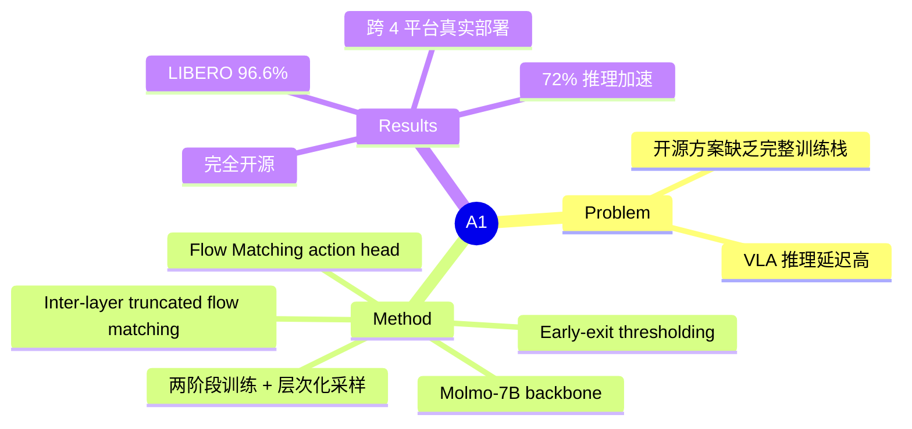

## Summary
A1 是一个完全开源的 VLA 框架，通过 budget-aware adaptive inference（early-exit + inter-layer truncated flow matching）将 flow-matching action head 的推理延迟降低最高 72%，同时在 LIBERO、VLABench 和真实机器人上保持 SOTA 水平的成功率。

## Problem & Motivation
当前 VLA 模型将数十亿参数的 VLM backbone 与迭代式 diffusion/flow-matching action head 结合，导致推理延迟高、计算成本大，难以在消费级硬件上实现实时机器人控制。现有开源 VLA 方案要么性能不足，要么缺乏完整的训练栈公开，限制了社区复现和改进。A1 试图同时解决效率和透明性两个问题。

## Method
**VLM Backbone**: 基于 Molmo-7B（vision encoder + 28 层 Qwen2），利用预训练权重提供 affordance 先验。

**Action Head**: 提供两种实现——
- **A1-FM (Flow Matching)**: 使用 Qwen3-400M 作为 expert，通过 conditional flow matching 生成 action 分布，采用 KV-conditioned self-attention 将 VLM prefix context 作为 cached KV 注入。
- **A1-MLP**: 简单 L1 回归。

**Adaptive Inference 加速**（核心贡献）：
1. **Early-Termination via Action-Consistency Thresholding**: 监测连续 VLM 层之间 action 预测的差异 $\Delta_i^t = d(A_t^{(i)}, A_t^{(i-1)})$，当差异低于阈值 $\eta_i$ 时提前退出。阈值通过训练数据上的 quantile-based 方法离线校准。
2. **Inter-Layer Truncated Flow Matching**: 关键创新——不在每层从随机噪声重新开始 denoising，而是用 $\delta=2$ 步 warm-start 初始化（$A_t^{0(i+1)} = A_t^{1(i)}$），跨层传播 denoising 进度。

**训练流程**: 两阶段——
- Pretraining（200K steps）: 使用 DROID、AgiBot、RoboCOIN 等多个开源数据集 + 15,951 条自采真实轨迹。冻结 ViT backbone，采用层次化平衡采样避免单数据源偏差。
- Fine-tuning: 针对具体任务微调。

## Key Results
**仿真**:
- LIBERO: 平均 96.6% 成功率，与 OpenVLA-OFT (97.1%) 和 $\pi_{0.5}$ (96.9%) 竞争力相当
- VLABench: 平均 53.5%，高于 $\pi_{0.5}$ (49.5%) 4 个百分点
- LIBERO-Plus zero-shot: 75.3%，优于 OpenVLA-OFT 和 $\pi_0$-FAST

**真实机器人**:
- 跨 Franka、AgiBot、WuJie-Arm、Dobot-Arm 四平台平均成功率 56.7%，高于 $\pi_{0.5}$ (47.5%) 和 $\pi_0$ (40.8%)
- RoboChallenge: 29.0%（开源最高），超过 $\pi_0$ (28.33%)、X-VLA (21.33%)

**效率**:
- Early-exit (c=1.0): 减少 15.6% backbone 计算
- Truncated flow matching ($\delta=2$ + warm-start): 每 episode 延迟从 37.8s 降至 10.5s（72.3% 降低）
- 极端设置 (c=0.1): 减少 76.6% 计算，性能仅下降 1.7%

## Strengths & Weaknesses
**亮点**:
- 完全开源（模型权重、训练代码、数据处理、评估协议），这在 VLA 领域尤为稀缺，$\pi_0$ 系列至今未公开完整训练栈
- Inter-layer truncated flow matching 思路简洁有效——利用了 flow trajectory 跨层的连续性，属于 first-principles 层面的观察
- 跨 4 种机器人平台的真实世界评估，覆盖面较广
- Ablation 充分，early-exit 阈值与性能的 trade-off 分析透明

**局限**:
- 仿真性能并未超越 SOTA（LIBERO 上略低于 OpenVLA-OFT），核心优势在效率而非精度
- 预训练依赖有标注的 affordance 数据集，数据规模受限
- 真实世界绝对成功率（56.7%）仍有很大提升空间，说明 imitation learning 的 compounding error 问题尚未解决
- 部分 baseline 对比（如 $\pi_0$、$\pi_{0.5}$）是否使用相同数据量和微调策略不完全清楚，可能存在对比不公平的风险

**影响**: 对开源 VLA 社区有直接推动作用。Adaptive inference 方案可以推广到其他使用 flow-matching 的 VLA 模型，但核心贡献更偏 engineering 而非 fundamental insight。

## Mind Map

## Notes

