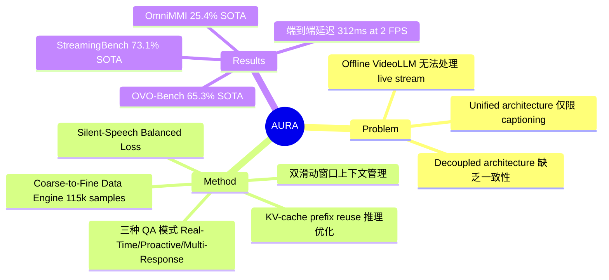

## Summary

AURA 提出了一个 streaming video interaction 框架，通过双滑动窗口上下文管理、三种 QA 交互模式和 Silent-Speech Balanced Loss，使 Video LLM 能够持续处理视频流并支持实时问答与主动响应，在多个 streaming benchmark 上取得 SOTA。

## Problem & Motivation

现有 VideoLLM 大多在 offline 场景下工作，即处理已经录制完成的视频，无法处理需要持续观察和即时响应的 live video stream。现有 streaming VideoLLM 存在两个主要局限：(1) decoupled architecture 使用独立的 trigger model，与响应生成缺乏一致性；(2) unified architecture 仅限于 captioning 式叙述，缺乏 robust 的 open-ended QA 能力。这个问题对于 always-on visual assistant（如可穿戴设备、实时监控、视频通话辅助）至关重要。

## Method

**Interactive Video Stream Context Management**：采用双滑动窗口策略管理无界视频流和交互历史——维护 30 秒视频窗口（N=30）和 10 组最近 QA 历史（M=10）。视频以 chunk-wise conversational format 组织，每个 chunk 附带可选 user query，assistant 响应或输出 `<|silent|>` token 表示无需回复。

**三种 QA 交互模式**：
- **Real-Time QA**：基于当前观察立即响应
- **Proactive QA**：在积累足够未来证据后延迟响应（主动触发）
- **Multi-Response QA**：跟踪演变事件，无需重复提问即可多次响应

**Coarse-to-Fine Data Engine**：五阶段 pipeline 构建 115k streaming 训练样本（约 1.04B tokens）：Video Preparation（2 FPS 标准化）→ QA Synthesis（MLLM 生成带时间戳的 QA）→ QA Refinement（难度增强与改写）→ Streaming Structuring（转换为 streaming 格式）→ Quality Verification（过滤幻觉样本）。

**Silent-Speech Balanced Loss**：解决两个训练问题——(1) 仅对最后一个 non-silent assistant message 施加监督（早期响应可能因截断缺乏视觉支持）；(2) 对 silent token 进行权重重平衡（w_silent = 1/N_silent），防止模型过度预测 silence。

**Real-Time Inference Framework**：集成 ASR 和 TTS 模块，通过 KV-cache prefix reuse（floating-window 策略，margin N'=15）、streaming output、异步运算实现端到端低延迟推理。

## Key Results

**StreamingBench**：73.1% overall accuracy，超越 MiniCPM-o-4.5 10.4%，超越 Gemini-1.5-Pro 6.0%。

**OVO-Bench**：65.3% overall accuracy，超越 ViSpeak 4.2%，超越 Gemini-1.5-Pro 2.3%。

**OmniMMI**：25.4% overall accuracy，所有模型中最优，9 个细粒度指标中 5 个排名第一。

**推理延迟**：TTFT 75.0ms，端到端延迟约 312.2ms（ASR 84.2ms + TTFT 75ms + decoding 60ms + TTS 93ms），2 FPS on two 80G accelerators。

**Offline 性能基本保持**：LongVideoBench 58.8%（base 61.9%），MVBench 68.1%（base 69.0%），Video-MME 65.1%（base 68.6%），下降幅度可控。

**Ablation**：将 Silent-Speech Balanced Loss 替换为标准 cross-entropy 后，OmniMMI 从 25.4% 降至 16.4%，Proactive Alerting 从 37.5% 降至 0.0%（模型陷入持续输出 silence），证明该 loss 设计的必要性。

## Strengths & Weaknesses

**Strengths**：
- 问题定义清晰且重要——streaming video interaction 是 Video LLM 走向实际应用的关键能力，三种 QA 模式的划分（尤其是 Proactive 和 Multi-Response）比现有工作更完整
- Silent-Speech Balanced Loss 设计简洁有效，ablation 结果极具说服力（Proactive 从 37.5% 到 0%）
- 数据构建 pipeline 系统化，从 raw video 到 streaming format 的转换流程可复用
- 端到端延迟约 312ms，已经接近实时交互的可用阈值

**Weaknesses**：
- 硬件要求高（two 80G accelerators），限制了实际部署场景
- 30 秒视频窗口 + 10 组 QA 历史的固定上下文设计，可能在需要长程依赖的场景中丢失关键信息
- Offline 性能有可测量的下降（LongVideoBench -3.1%, Video-MME -3.5%），streaming 与 offline 之间存在固有优化张力
- 训练数据完全依赖 MLLM 合成，可能引入 teacher model 的 bias
- Base model 为 Qwen3-VL-8B，仅 fine-tune LLM 部分（vision encoder 和 connector frozen），未探讨更大规模模型或端到端训练的效果

## Mind Map

## Notes

- Streaming Video LLM 是一个快速发展的方向，AURA 的 context management 和 loss 设计值得关注
- Proactive QA 的能力对 embodied AI 场景（如机器人持续观察环境并主动提醒）有直接启发
- Silent token 的处理是 streaming 场景的独特挑战，balanced loss 的思路可推广到其他需要"何时说话"决策的系统
