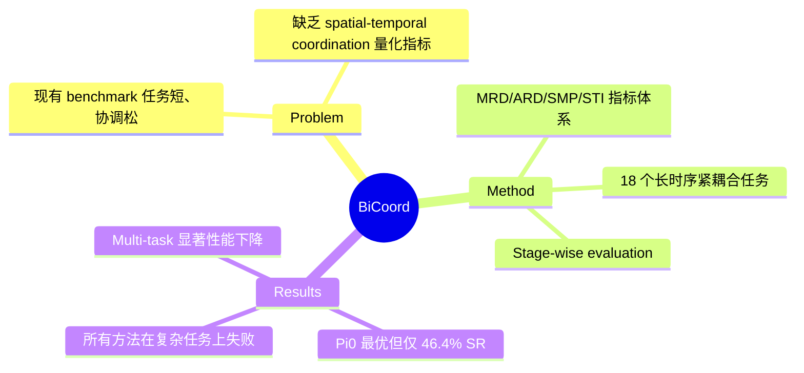

## Summary

现有 bimanual manipulation benchmark 任务过短且双臂协调松散，BiCoord 提出包含 18 个长时序、紧耦合双臂操作任务的 benchmark，并设计了 spatial-temporal coordination 量化指标体系，实验表明 DP、RDT、Pi0、OpenVLA-OFT 等主流策略在长时序紧耦合任务上表现不佳。

## Problem & Motivation

Bimanual manipulation 是实现 human-level dexterity 的关键能力，但现有 benchmark（如 RoboTwin、RLBench2）存在两个核心缺陷：（1）任务短时序（short-horizon），仅需少量 motion primitives 即可完成；（2）双臂协调松散（loosely coordinated），两臂几乎独立操作或仅在时间上分离执行。真实世界的双臂操作需要 phased coupling（交替协作/独立阶段）、spatial-temporal constraints（同步定位）和 predictive coordination（预判另一臂动作），现有 benchmark 无法反映这些特性。

## Method

BiCoord 基于 RoboTwin2.0 平台构建，核心包含三部分：

**任务设计**：18 个多样化任务，要求持续的 inter-arm dependency 和 dynamic role exchange，平均 4.27 个 stage（是已有 benchmark 的 3 倍），平均 trajectory 长度 361 步（提升 63%）。任务包括 balance roller、build bridge、cook、jigsaw 等场景。

**Spatial-Temporal Coordination 指标体系**：
- Spatial 维度：Minimum Relative Distance (MRD) 和 Average Relative Distance (ARD)，衡量双臂间距离耦合程度
- Temporal 维度：Simultaneous Movement Time (SMT) 和 Simultaneous Movement Percentage (SMP)，衡量双臂同时运动的比例
- 耦合指标：Spatial-Temporal Integral (STI)，在距离阈值上对 SMP 积分，综合衡量时空耦合程度

**Stage-wise 评测**：提供 stage-wise annotation 和 Stage-wise Success Rate (SSR)，支持细粒度分析策略在不同阶段的表现衰减。

**数据生成**：通过 coding agent + human-in-loop 生成 action code，每个任务 100 条成功 trajectory，10 个 random seed 需达 60% 成功率门槛。

## Key Results

在 single-task learning 设定下评测 4 种代表性方法：

| 方法 | Avg SR | Avg SSR | Avg TL |
|------|--------|---------|--------|
| DP | 33.1% | 52.1% | 307 |
| RDT | 39.5% | 57.3% | 387 |
| OpenVLA-OFT | 40.5% | 52.3% | 401 |
| Pi0 | **46.4%** | **62.6%** | 380 |

- Pi0 整体最优，VLA pretrain 的优势显著
- Build Tower With Blocks 所有方法 0% SR，Handover Block With Bowls 接近零（精确对齐能力不足）
- DP 的 trajectory 最短（比 Pi0 短 9.75%），执行效率最高
- Multi-task learning 导致显著性能下降：Pi0 从 46.4% 降至 27.2%，RDT 从 39.5% 降至 16.9%
- Pi0 在 Divide Block Tower 中当 block 颜色改变时失败，说明策略无法通过颜色关联 block 和 landmark（缺乏推理能力）

## Strengths & Weaknesses

**Strengths**：
- 填补了长时序紧耦合 bimanual manipulation benchmark 的空白，任务设计有层次感
- Spatial-temporal coordination 指标体系设计系统，STI 指标能综合刻画双臂协调程度，比单一指标更有信息量
- Stage-wise evaluation 可以精确定位策略在哪个阶段开始崩溃，对调试和改进策略有直接价值
- 公开数据、代码和 checkpoints，可复现性好

**Weaknesses**：
- 所有评测均基于 imitation learning，未涉及 RL 或 hierarchical planning 方法，而这些方法在 long-horizon 任务上可能更有优势（作者在 conclusion 中承认了这一点）
- 任务仍局限于 RoboTwin2.0 仿真环境，sim-to-real gap 未讨论
- 18 个任务虽然数量有增长，但 diversity 是否足以覆盖真实 bimanual manipulation 的核心挑战模式存疑
- 指标设计基于双臂末端执行器位置，未考虑 force/contact 维度的协调，而许多真实双臂任务（如拧瓶盖、折叠衣物）需要力的协调

**影响**：该 benchmark 为 bimanual manipulation 研究提供了更有挑战性的测试场景，暴露了现有策略在 long-horizon coordination 上的不足，有望推动该方向的方法创新。

## Mind Map

## Notes

- 与 [[Papers/2502-OpenVLA-OFT]] 直接相关，BiCoord 作为更难的 benchmark 进一步暴露了 OpenVLA-OFT 在长时序协调上的不足
- 与 [[Papers/2503-MoManipVLA]] 可对比，后者关注 mobile manipulation，而 BiCoord 聚焦固定基座双臂
- "如何结合 DP 的稳定性和 VLA 的泛化性" 是作者提出的开放问题，值得关注
- STI 指标的设计思路（在多个阈值上积分）类似 mAP 在 object detection 中的做法，有一定通用性
