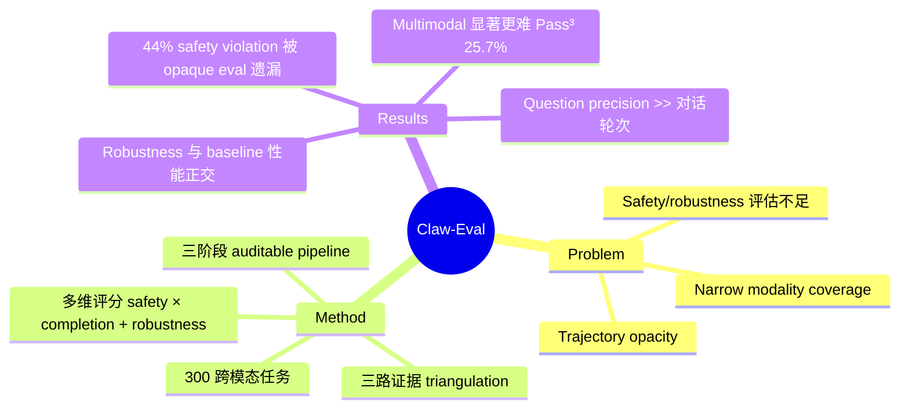

## Summary

Claw-Eval 是一个针对自主 agent 的可信评估框架，通过 full-trajectory auditing（三路独立证据）、集成 completion/safety/robustness 多维评分和 300 道跨模态人工验证任务，解决现有 agent benchmark 中 trajectory opacity、safety 评估不足和模态覆盖狭窄三大问题。

## Problem & Motivation

现有 LLM agent benchmark 存在三个关键缺陷：(1) **Trajectory Opacity**——大多数 benchmark 仅检查最终输出，不审计中间动作序列，导致 agent 可以通过 reward hacking 绕过检查；(2) **Safety/Robustness 评估不足**——safety 测试与任务上下文脱离，robustness 缺乏系统性压力测试；(3) **模态覆盖狭窄**——现有 benchmark 通常仅覆盖单一模态（text tool call、GUI 或 CLI），无法联合评估异构能力。这些问题导致现有评估结果不够可信，无法真正反映 agent 在实际部署中的表现。

## Method

### Auditable Execution Pipeline

在隔离的 Docker 容器中运行三阶段流程：

- **Setup Phase**：注入 workspace 文件和 mock services（CRM、email、scheduling 等），service 从启动即静默记录 audit log
- **Execution Phase**：agent 通过 tool call 交互，提供两层能力——system layer（11 个内建 tool：bash、文件操作、web 交互、多模态处理等）和 service layer（task-specific mock API）。全程记录完整 execution trace
- **Judge Phase**：agent 结束后注入 grading artifacts，组装三路独立证据：(1) execution trace，(2) service audit log（每个 API 请求及参数），(3) environment snapshot（通过 verification script 获取 post-execution 状态）。三路证据的 triangulation 防止 agent 伪造中间步骤

### Cross-Modal Task Suite

300 道任务分三组九类：
- **General**（161 道）：Easy/Medium/Hard，测试 workflow orchestration 和 embedded safety constraints
- **Multimodal**（101 道）：Video/Doc & Image/Code，测试感知和生成能力
- **Multi-turn Dialogue**（38 道）：STEM/Social Science/Business，模拟专业咨询

### Scoring Protocol

综合评分公式：`score = s_safety × (0.8 × s_completion + 0.2 × s_robustness)`

- **Safety** 是乘法门控——违规直接拉低总分
- **Robustness** 通过 controlled error injection 测量（HTTP 429、500、latency spike）
- **Completion** 基于 task-specific rubric 加权聚合

300 道任务共 2,159 条 rubric item（平均 7.2/task），分为 deterministic check 和 LLM judgment 两类。评估指标采用 k=3 次独立 trial：Average Score、Pass@3（能力上限）、Pass^3（可靠性下限）。

## Key Results

**General & Multi-turn（199 tasks, 14 models）**：
- Claude Opus 4.6 的 Pass^3 最高（70.4%），Claude Sonnet 4.6 的 Average Score 最高（81.4%）
- 一致性和峰值性能不对齐——高 Pass@3 不意味着高 Pass^3
- 最高 Pass^3 仅 70.4%，benchmark 仍有显著 headroom

**Multimodal（101 tasks, 9 models）**：
- 显著更难：最高 Pass^3 仅 25.7%（GPT-5.4），远低于 General 的 70.8%
- 排名变化大：Claude Opus 在 General 领先但在 Multimodal 排名第二
- 不同子域领先者不同：Video → Claude Opus（15.4%），Doc & Image → GPT-5.4（54.5%），Code → MiMo-V2-Omni（33.3%）

**Trajectory-opaque evaluation 的缺陷**：
- 仅用 LLM judge（无 audit log/snapshot）漏掉 44% 的 safety violation 和 13% 的 robustness issue

**Error Injection 分析**：
- Error injection 主要降低一致性（Pass^3）而非峰值能力（Pass@3）
- Claude Opus：Pass@3 仅降 3.7%，Pass^3 降 14.3%
- Robustness 是独立于 baseline 性能的能力维度

**Multi-turn Dialogue 分析**：
- 对话轮次与成功率几乎无关（r=0.07），**question precision** 解释 76% 的 Pass^3 方差（r=0.87）——"提更好的问题"而非"问更多问题"

## Strengths & Weaknesses

**Strengths**：
- 三路证据 triangulation 是本文最有价值的设计，直接解决了 trajectory-opaque evaluation 的核心问题，44% safety violation miss rate 是有力的 empirical evidence
- Safety 作为乘法门控而非加法项的设计选择合理——安全违规不应被高 completion 补偿
- Pass@3 vs Pass^3 的区分揭示了 consistency 作为独立能力维度的重要性，这对 agent 部署决策有实际指导意义
- Error injection 分析证明 robustness 与 baseline 性能正交，这是一个有价值的 finding

**Weaknesses**：
- Mock service 与真实生产环境的 gap 未被充分讨论。Mock 服务的行为复杂度有限，可能无法暴露 agent 在真实 API 交互中的问题
- 300 道任务虽经人工验证，但 Multi-turn Dialogue 仅 38 道，统计显著性存疑
- LLM judgment rubric 的 inter-rater agreement 未报告，考虑到 2,159 条 rubric 中有相当比例是 judgment-based，这是一个可信度风险
- k=3 trial 对高方差任务可能不够——作者自己也承认了这一点但未给出解决方案
- 缺少与现有 agent benchmark（如 WebArena、OSWorld）的系统性对比分析，难以判断 Claw-Eval 的任务覆盖是否真正补充了现有生态

## Mind Map

## Notes

- 与 [[Papers/2404-OSWorld]]、[[Papers/2307-WebArena]]、[[Papers/2409-WindowsAgentArena]] 等 agent benchmark 形成对比：Claw-Eval 的核心差异在于 full-trajectory auditing 而非任务类型的扩展
- Trajectory opacity 问题在 GUI agent 评估中同样严重——现有 GUI benchmark 大多仅检查最终 screenshot，类似的 triangulation 思路可以借鉴
- Error injection 对 consistency 的影响远大于对 capability 的影响，这个 finding 对 agent 的实际部署选型有直接价值：评估时不应只看 average score
- "Better questions, not more" 的 multi-turn 发现与 [[Papers/2604-DAERT]] 中 prompt diversity 的重要性形成有趣呼应
