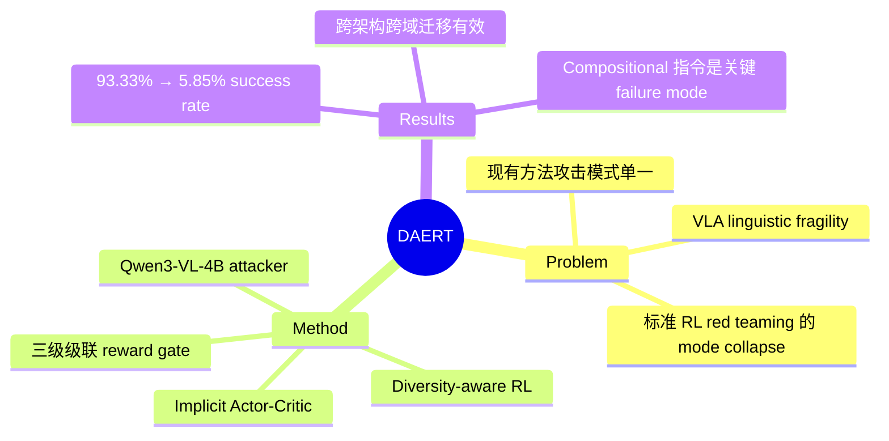

## Summary

提出 DAERT（Diversity-Aware Embodied Red Teaming）框架，利用 diversity-aware RL 自动生成多样化的对抗性语言指令，系统性暴露 VLA 模型对语言变化的脆弱性，将 π₀ 和 OpenVLA 的任务成功率从 93.33% 降至 5.85%。

## Problem & Motivation

VLA 模型在 robotic manipulation 中表现出色，但对语言指令的微小变化（同义改写、句法重组等）极度敏感，即使任务语义不变，性能也会大幅下降。这种 linguistic fragility 对真实部署构成安全隐患。现有 red teaming 方法要么依赖固定 prompt 的 in-context learning（如 GPT-4o），缺乏适应性；要么使用标准 RL 但陷入严重的 mode collapse，只能发现单一攻击模式，无法全面暴露 VLA 的脆弱面。

## Method

DAERT 将 VLA red teaming 形式化为一个 RL 问题，核心创新在于引入 diversity-aware 机制避免 mode collapse：

- **Attacker Policy**：以 Qwen3-VL-4B 为基础，输入初始场景图像和原始指令，生成对抗性指令变体
- **Implicit Actor-Critic**：采用 implicit Q-parameterization 替代标准 policy gradient，通过 breadth-seeking bias 惩罚概率分布的尖峰集中，自然维持输出多样性。灵感来自 Random Policy Valuation
- **Physically-Grounded Reward Design**：三级级联约束门控确保生成指令的有效性：
  1. **Executable Format Gate**：过滤退化文本（换行符、非英文字符等），penalty -0.2
  2. **Action-Intention Preservation Gate**：用 CrossEncoder 保证语义相似度 > 0.6，确保对抗指令描述相同物理任务
  3. **Conciseness Control Gate**：限制指令长度，防止 verbosity hacking（通过超长指令导致 context overflow 而非真正暴露语言理解缺陷）
- 只有通过全部约束的指令才送入 VLA 执行评估，节省昂贵的 rollout 开销
- 训练使用 VERL 框架，Group Relative Training 处理 sparse binary reward

## Key Results

**LIBERO benchmark (π₀)**：
| Method | Avg Success Rate | Cosine Distance ↑ | LLM Diversity Score ↑ |
|--------|:---:|:---:|:---:|
| Baseline | 93.33% | – | – |
| ERT (GPT-4o) | 65.50% | 10.15 | 6.35 |
| GRPO | 20.45% | 7.05 | 4.58 |
| DAERT | **5.85%** | **12.23** | **8.48** |

- DAERT 在攻击效果和多样性两个维度同时最优，GRPO 虽有效但 mode collapse 严重
- **OpenVLA (LIBERO)**：成功率从 76.50% 降至 6.25%，跨架构迁移有效
- **CALVIN (3D-Diffuser Actor)**：DAERT 在 Pareto frontier 上占优
- **SimplerEnv (OpenVLA-7B, zero-shot)**：攻击成功率 82.0%，优于 GRPO (59.5%) 和 ERT (69.2%)
- 定性分析发现 DAERT 生成的攻击指令倾向于加入 compositional constraints（如分步描述、方向约束），这超出了 VLA 训练时见到的简短指令分布

## Strengths & Weaknesses

**Strengths**：
- 问题定义清晰且实际重要——VLA 的 linguistic fragility 是真实部署的关键障碍
- Diversity-aware RL 设计合理，三级 reward gate 的级联设计既保证了生成质量又节省了计算
- 实验覆盖多个 VLA 架构（π₀、OpenVLA、3D-Diffuser Actor）和多个 benchmark，跨域迁移结果令人信服
- 发现的 failure mode 有实际意义：VLA 对 compositional/procedural 描述的脆弱性揭示了训练数据分布的局限

**Weaknesses**：
- 生成的对抗指令风格偏 verbose/procedural（论文自己承认的 "Translationese effect"），与真实用户指令分布可能存在 gap——这些 failure 在实际部署中多大概率被触发值得讨论
- Ablation 较薄，仅分析了 KL 约束的影响，缺少对语义相似度阈值、conciseness gate 等关键超参的敏感性分析
- 论文聚焦于暴露问题但未讨论 defense——发现的 failure pattern 能否用于数据增强或 adversarial training 来提升 VLA 鲁棒性？
- Attacker 模型（Qwen3-VL-4B）的选择对结果的影响未探讨

## Mind Map

## Notes

- 这篇工作揭示了一个重要但容易被忽视的问题：VLA 模型可能只是在做 surface-level pattern matching 而非真正的 compositional language understanding。这与 NLP 领域早期对 BERT 等模型 robustness 的批评类似
- 从 defense 角度看，DAERT 生成的多样化对抗指令可以作为训练数据增强的来源，这可能是一个有价值的后续方向
- 与 [[Papers/2406-OpenVLA]]、[[Papers/2410-Pi0]] 的 robustness 评估形成互补——这些工作主要关注 visual perturbation，而 DAERT 聚焦 linguistic perturbation
