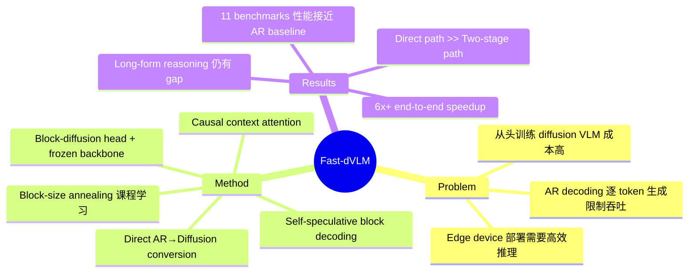

## Summary

Fast-dVLM 提出将预训练的 autoregressive VLM 直接转换为 block-diffusion 模型，通过并行多 token 生成实现推理加速（最高 6x+ speedup），同时在 11 个 benchmark 上保持接近原模型的视觉理解性能。

## Problem & Motivation

当前 VLM 依赖 autoregressive decoding，逐 token 生成从根本上限制了推理吞吐量。这在 physical AI 场景（机器人、自动驾驶）中尤为突出——边缘设备 compute budget 有限，batch size 通常为 1，AR decoding 变为 memory-bandwidth-bound 而非 compute-bound。Diffusion-based parallel decoding 可以同时生成多个 token，将负载转向 compute-bound 范围，是一个自然的解决方案。但从头训练 diffusion VLM 成本高昂，如何高效复用已有 AR VLM 是核心问题。

## Method

核心思路：在 frozen VLM backbone 之上添加轻量 block-diffusion head，通过 masked token prediction 目标训练，将 AR VLM 转换为支持并行解码的 block-diffusion 模型。

关键设计选择：

1. **Direct Conversion vs. Two-Stage**：直接将完整 AR VLM 一步转换（direct path）vs. 先对 LLM backbone 做 text-only diffusion fine-tuning 再接 vision（two-stage）。实验表明 direct path 显著更优（73.3 vs. 60.2 avg score），因为能更好地保留预训练的 vision-language alignment。

2. **Dual-Stream Architecture**：noisy stream 和 clean stream。Noisy tokens 在 block 内 bidirectional attention，对前序 block 的 clean tokens 做 causal attention。

3. **Causal Context Attention**：前序 context 使用 token-level causal attention 而非 block-level bidirectional attention，保留预训练 AR 表征，并支持 speculative verification。ablation 显示移除此设计导致 -22.5% accuracy。

4. **Block-Size Annealing**：渐进式课程学习，block size 从 2¹ 增长到 2⁵，让模型先掌握细粒度 denoising 再处理大范围 corruption。移除后 -4.4% accuracy。

5. **Auto-Truncation Attention Mask**：在多轮对话的 turn boundary 处截断 response block，防止未来信息泄漏。移除后 -3.7% accuracy。

6. **Vision-Efficient Concatenation**：vision embeddings 仅出现在 clean stream 中（不被 corrupt），减少 15% peak memory 和 14.2% 训练时间。

7. **Self-Speculative Block Decoding**：两种变体——linear（每 block 2 passes）和 quadratic（O(B²) cost，单 pass），进一步提升吞吐。

训练目标：diffusion loss + causal LM loss，权重各 0.5（α=β=0.5）。

## Key Results

在 11 个 benchmark 上评测（AI2D, ChartQA, DocVQA, GQA, MMBench, MMMU, POPE, RealWorldQA, SEEDBench2+, TextVQA, MMMU-Pro-V）：

- **Short-answer tasks**：Fast-dVLM 达到 74.0 avg score（与 AR baseline 持平），speculative decoding 下 2.63x Tokens/NFE 提升
- **Long-answer tasks (MMMU-Pro-V)**：AR baseline 26.3 → masked diffusion 21.4（-4.9），speculative decoding 缩小到 24.6（仅 -1.7）
- **端到端加速**：结合 SGLang 集成和 FP8 量化，实现超过 **6x** end-to-end inference speedup
- **Direct vs. Two-Stage**：direct path 73.3 vs. two-stage 60.2（+13.1），证明直接转换的显著优势

Ablation 关键发现：
| 组件 | 移除后影响 |
|:--|:--|
| Causal context attention | -22.5% |
| Block-size annealing | -4.4% |
| Auto-truncation mask | -3.7% |

## Strengths & Weaknesses

**Strengths:**
- **实用性强**：不需要从头训练，可直接转换任意 pretrained AR VLM，大幅降低部署门槛。这对 edge device 部署 VLM 有直接价值
- **工程设计扎实**：每个组件都有 ablation 支撑，causal context attention 的 -22.5% ablation 尤其说明保留 AR 预训练表征的关键性
- **加速效果显著**：6x+ end-to-end speedup 是实质性提升，且结合了系统级优化（SGLang, FP8），不只是理论上的 tokens/NFE
- **Direct conversion 的 insight**：two-stage 路径的大幅落后（-13.1）揭示了 vision-language alignment 在转换过程中的脆弱性，这个发现有普适价值

**Weaknesses:**
- **Long-form reasoning 仍有差距**：MMMU-Pro-V 上 -1.7 的 gap 反映了 block-wise parallel denoising 在长序列 sequential coherence 上的结构性劣势，作者也承认这一点。对于需要复杂推理的任务，这个局限可能更显著
- **Benchmark 局限性**：11 个 benchmark 偏向 short-answer VQA，缺少对 open-ended generation quality（如 detail description、instruction following）的系统评测
- **训练数据和成本细节**：论文未充分讨论 block-diffusion head 的训练数据量和计算成本，"lightweight" 的定义需要更多定量支撑
- **与 Embodied AI 场景的距离**：虽然 motivation 提到 robotics 和 autonomous driving，但实验完全在 VQA benchmark 上，没有在实际 latency-sensitive 场景中验证

**对领域的影响**：为 VLM 推理加速提供了一条有前景的路径，特别是 "AR → diffusion conversion" 的范式可能启发后续工作。但对 Embodied AI 的实际影响取决于能否在 action generation（而非 text QA）场景中也保持加速效果。

## Mind Map

## Notes

- 与 VLA 的关联值得关注：如果 block-diffusion conversion 能应用于 VLA 模型的 action token 生成，可能在机器人控制的实时性上有显著提升。但 action tokens 的 sequential dependency 可能比 text 更强，需要验证
- Block-size annealing 的课程学习思路有普适性，可能在其他 diffusion-based generation 任务中也有用
- 论文来自 HKU + NVIDIA + MIT + Song Han 组，工程实现能力强，SGLang 集成表明有系统级部署的考量
