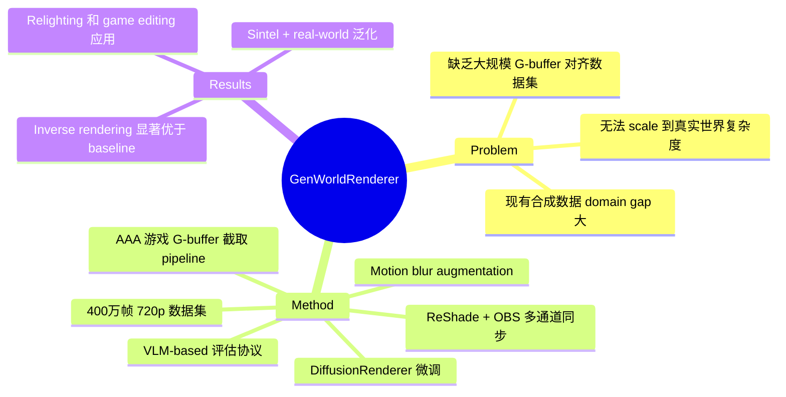

## Summary
提出了一个从 AAA 游戏（Cyberpunk 2077、Black Myth: Wukong）中自动采集大规模 RGB + G-buffer 对齐数据集的 pipeline，并基于此训练统一的双向 generative rendering 框架，同时支持 inverse rendering（RGB→G-buffer 分解）和 forward rendering（G-buffer→RGB 合成），在真实场景泛化上显著优于现有方法。

## Problem & Motivation
将 generative rendering scale 到真实世界场景的核心瓶颈是缺乏大规模、时序连贯、带 G-buffer ground truth 的合成数据集。现有合成数据集场景复杂度有限、相机轨迹固定、材质模型简化，且缺少恶劣天气等条件，导致持续的 domain gap。作者认为 AAA 游戏引擎天然提供了视觉复杂度接近真实世界的渲染结果，是弥补这一 gap 的理想来源。

## Method
**数据集构建 pipeline：**
- **G-buffer 截取**：使用 ReShade 在图形 API 层截取运行时 G-buffer（depth、normal、albedo、metallic、roughness），无需反编译；用 RenderDoc 离线分析 render pass 以识别目标 buffer
- **多屏录制**：将所有 G-buffer 通道 shade 到屏幕，通过 OBS 硬件加速捕获实现多通道同步录制。采用 mosaic 拼接策略，双 2K 显示器拼接实现每通道 720p 有效分辨率，六通道严格时序对齐
- **场景遍历**：Cyberpunk 2077 使用半自动驾驶路点系统；Black Myth: Wukong 从通关存档出发进行自由探索
- **法线重建**：从深度图通过有限差分重建 camera-space normal（normalize(∂P/∂x × ∂P/∂y)）
- **Motion blur 合成**：用 RIFE 帧插值 + 线性域平均合成 motion blur，增强训练鲁棒性

**数据集规模**：400 万连续帧，720p/30FPS，5 个同步 G-buffer 通道，标注包括纹理类型、天气条件、室内/室外、相机运动动态。

**训练**：基于 DiffusionRenderer 微调，57 帧 clip @24FPS @1280×720。长 clip 变体（113 帧）显著改善长视频推理。Motion augmentation 一致性提升所有指标。

**VLM 评估协议**：用 Gemini 3 Pro 评估时序一致性、空间质量和语义合理性，25 名 CG 专家 user study 验证该评估与人类偏好一致（metallic 85%、roughness 75% 一致率）。

## Key Results
- **Black Myth Wukong benchmark**（39 clips, 57 frames each）：depth RMSE log 0.430 vs baseline 0.723；metallic RMSE 0.104 vs 0.281；roughness RMSE 0.266 vs 0.281
- **Sintel benchmark**：depth RMSE 0.220 vs DiffusionRenderer 0.268；albedo 指标同样优于 baseline
- **Real-world evaluation**（40 clips, VLM-based）：微调 + motion augmentation 在所有指标上提升
- **Motion blur ablation**：加入 motion blur 后 depth RMSE log 从 0.773 降至 0.745，强运动模糊下时序稳定性显著改善
- **应用**：relighting（G-buffer 支持的一致重光照）和 game editing（超越 ControlNet、SDEdit 等 baseline，能生成雾、雨等 volumetric 效果）

## Strengths & Weaknesses
**Strengths：**
- 数据采集 pipeline 设计巧妙——利用 ReShade + OBS 实现无侵入式 G-buffer 捕获，避免反编译，可复现性强，且承诺开源 toolkit
- 数据规模和多样性远超现有合成数据集（4M frames、多天气、多场景类型），两款游戏的材质分布互补
- 双向 rendering 统一框架（inverse + forward）共享 G-buffer 表示，思路简洁
- VLM-based 评估协议为缺乏 ground truth 的真实场景提供了可行的自动化评估方案，并有 user study 验证

**Weaknesses：**
- 核心 rendering 模型本身贡献有限——直接微调 DiffusionRenderer，方法创新主要在数据侧
- Camera-space normal 无法从 world-space 可靠转换（view matrix 不可获取），限制了某些下游应用
- 数据来源仅两款游戏，场景多样性虽好但仍受游戏美术风格约束，对非游戏风格的真实场景泛化能力存疑（推测）
- CC BY-NC-SA 4.0 非商用许可限制了工业应用
- 对于 world model / embodied AI 而言，缺少 action-conditioned generation 能力，更偏 graphics/rendering 方向

## Mind Map

## Notes
- 数据 pipeline 思路值得借鉴——从成熟游戏引擎中低成本获取高质量标注数据，可能启发 embodied AI 领域的数据采集（如从游戏中获取 action-conditioned 视频数据）
- 与 [[Papers/2408-GameNGen]] 的思路有呼应：都是利用游戏引擎作为数据/训练来源，但本文聚焦 rendering quality 而非 interactive generation
- VLM-based evaluation protocol 可能对其他缺乏 ground truth 的生成任务有参考价值
