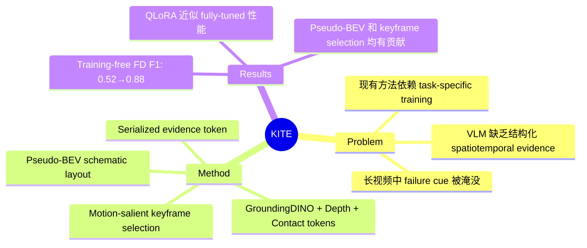

## Summary

KITE 是一个 training-free 的前端模块，将长时间机器人执行视频压缩为 keyframe-anchored、layout-grounded 的结构化 evidence page，使通用 VLM 能在单次 forward pass 中完成 failure detection、classification 和 localization，将 GPT-4o 的 failure-detection F1 从 0.59 提升至 0.88。

## Problem & Motivation

机器人执行中的失败线索往往分散在长视频的时间和空间中——subtle failure cues 容易被 dense visual detail 淹没，temporal context 被稀释。现有方法要么依赖 task-specific fine-tuning（如 RoboFAC），要么直接将原始视频/caption 喂给 VLM，效果不佳。核心未解决的问题是 representation problem：如何将长执行序列转化为紧凑且保留关键 spatiotemporal evidence 的形式，使 VLM 能够有效推理 where（空间布局、接触）、when（偏差时刻）、what/how（任务意图与失败模式）。

## Method

KITE pipeline 包含四个核心模块：

**1. Keyframe Selection**：基于 dense optical flow（Farneback）计算帧间运动幅度，通过 temporal non-maximum suppression 选取 motion-salient peaks 作为 keyframe（budget M=8）。若 salient frames 不足则用 uniform sampling 补充。选择 dense flow 而非 sparse flow 是因为 manipulation failure 通常涉及 arm、gripper、object 的分布式运动。

**2. Per-Keyframe Perception**：
- Open-Vocabulary Detection（GroundingDINO Swin-T）检测物体和机器人部件，每帧最多 5 个 detection
- Depth-Anything-V2 估计单目相对深度，仅作为 coarse ordering cue
- Contact-Transition Proxy：通过 gripper-object 之间的 IoU 和 distance 变化计算 Gain/Loss/Stable token，追踪接触状态变化

**3. Pseudo-BEV Schematic**：渲染非度量的 top-down 示意图（256x256），用圆圈表示物体（半径正比于 confidence），标注 class label 和 consistent instance ID。作者明确强调这不是 metrically accurate map，而是帮助 VLM 理解空间关系的 schematic layout cue。

**4. Serialized Evidence Token（T）**：将 robot morphology、workspace description、task plan、timestamped keyframe tags、contact tokens、scene graph relations 序列化为统一 context string。VLM 输入为 2xM 张图片（每个 keyframe 一张 RGB + 一张 pseudo-BEV）加上该 token。

## Key Results

在 RoboFAC benchmark（60K+ training pairs, simulation + real-world）上评估七类 failure analysis 任务：

**Simulation（Training-free, Qwen2.5-VL-7B）**：
- Failure Detection F1: 0.52 → 0.88（+36 points）
- Failure Identification: 0.26 → 0.44（+18 points）
- Failure Localization: 0.22 → 0.55（+33 points）

**KITE + QLoRA（rank 8, 4-bit, single epoch）**达到与 RoboFAC fully-tuned model 近似的性能（FD 0.93 vs 0.91, FI 0.69 vs 0.63, FL 0.92 vs 0.94）。

**Ablation 分析（real-world）**：
- 去掉 pseudo-BEV：FE ROUGE-L 从 0.252 降至 0.202，空间理解明显退化
- 换成 uniform keyframe sampling：全面退化，尤其 temporal localization（FL 从 0.74 降至 0.56）
- Motion-salient keyframe selection 是最关键的组件

## Strengths & Weaknesses

**Strengths**:
- **Training-free 且 VLM-agnostic**：作为前端模块可插入任何 VLM，实用性强。这种"外部化证据表示"的思路比端到端 fine-tuning 更灵活，也更容易 scale 到新任务
- **结构化 evidence 设计有说服力**：将视觉信息分解为 keyframe + pseudo-BEV + contact token + scene graph 的多层表示，每层都有清晰的信息贡献，ablation 验证了各组件的价值
- **问题定义完整**：覆盖 detection/identification/localization/explanation/correction 五类任务，比单纯的 failure detection 更全面

**Weaknesses**:
- **Perception 模块的脆弱性**：依赖 GroundingDINO 和 monocular depth，对 small/occluded/reflective objects 容易失败。这在真实部署中是常见场景，论文未充分讨论降级策略
- **Real-world 提升有限**：real-world 上 training-free KITE 的提升远小于 simulation（FD 仅 +1），这暗示 sim-to-real gap 可能不在 representation 而在其他因素，论文对此缺乏深入分析
- **评估局限**：主要基于 RoboFAC benchmark，in-lab 验证（DART, ALOHA-2）仅为定性展示。244-trial 的规模偏小，且任务类型有限
- **Pseudo-BEV 的价值存疑**：作为 non-metric schematic，它能提供的信息量是否真的超过 VLM 直接从 RGB 推断空间关系？ablation 显示去掉后主要影响 FE（explanation），对 FD 影响较小（0.84→0.81）

## Mind Map

## Notes

- 核心 insight 是"VLM 的瓶颈不在推理能力而在输入表示"——通过外部化结构化证据来 bridge representation gap。这个思路在 embodied AI 中有更广泛的应用空间，比如 task planning 或 long-horizon reasoning
- 与 [[Papers/2603-SGVLA]] 的 scene graph 思路有呼应，但 KITE 用于 post-hoc 分析而非在线决策
- Contact-transition proxy 是一个有趣的 lightweight 设计，但基于 IoU/distance 的方式对 deformable objects 或 multi-finger manipulation 可能不够
- Real-world 提升远小于 simulation 这一点值得关注——可能意味着 real-world failure 的 bottleneck 不在 representation 而在 VLM 本身的 visual grounding 能力
