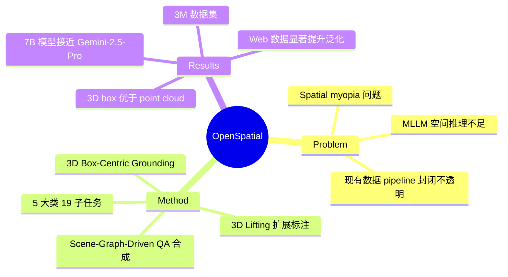

## Summary

提出 OpenSpatial，一个统一、可扩展的开源空间数据引擎，以 3D oriented bounding box 为核心表征，通过 scene graph 驱动的 QA 合成覆盖 5 大类 19 个空间子任务，生成 3M 规模数据集，训练的模型在空间推理 benchmark 上取得约 19% 的相对提升，接近 Gemini-2.5-Pro 水平。

## Problem & Motivation

当前 MLLM 在语义理解上表现优秀，但空间推理能力严重不足——无法准确感知距离、保持多视角一致性或构建空间认知地图。核心瓶颈不在模型架构，而在数据：现有空间数据生成依赖封闭、专有的 pipeline，缺乏透明性和可复现性，导致所谓的 "spatial myopia"（高 benchmark 分数但缺乏真实世界泛化能力）。亟需一个开源、有原则的数据引擎来统一异构空间数据的生产。

## Method

**核心设计原则**：

1. **3D Box-Centric Grounding**：所有标注锚定在 object-aligned 3D oriented bounding boxes (OBBs) 而非 2D 投影。每个物体参数化为 (x,y,z,x_l,y_l,z_l,r,p,y)，提供 viewpoint-invariant 的世界坐标表征，支持 metric reasoning 和跨视角对应。

2. **3D Lifting for Scalability**：除了遵循 EmbodiedScan 协议的手动标注外，设计了自动化 pipeline——用 Gemini 做物体识别、SAM 做 instance segmentation，在 3D 空间中关联和合并实例，拟合 convex hull 生成 oriented boxes。这使得标注能力扩展到未策划的 web 数据和开源资产。

3. **Scene-Graph-Driven Synthesis**：通过 scene graph 程序化生成平衡的 QA pairs，覆盖多样的空间任务，而非依赖 ad-hoc 数据收集。

**数据处理 Pipeline**：场景级 3D box 标注 → 属性中心的物体-帧映射（含基于深度的 volumetric occupancy 遮挡过滤和 SAM-refined 2D masks）→ QA 合成（单视角和多视角）。

**5 大核心任务（19 个子任务）**：
- Spatial Measurement (SM)：几何度量（长、宽、高、距离）
- Spatial Relationship (SR)：相对定位和物体间依赖关系
- Camera Perception (CP)：相机位姿估计和物体-相机关系
- Multi-view Consistency (MC)：跨视角对应
- Scene-Aware Reasoning (SAR)：场景级理解和导航规划

**数据来源**：EmbodiedScan（ScanNet、Matterport3D、ARKitScenes 的手动 3D box 标注）、ScanNet++、Hypersim，以及通过 3D lifting 获取的 web 数据，最终产出 3M 规模数据集。

## Key Results

- **OpenSpatial-Qwen2.5-VL-7B**：3D-Average 达 59.5（+9.5），在 BLINK (+10.6)、AllAngles (+8.3)、MMSI (+13.1) 上提升显著
- **OpenSpatial-Qwen3-VL-8B**：3D-Average 达 62.1，接近 Gemini-2.5-Pro 的 62.4
- **质量对比**（500k 规模匹配）：OpenSpatial 子集在各 benchmark 上 mean deviation 最低 (-2.5)、standard deviation 最小 (4.4)，表现最均衡
- **Data Scaling**：从 20% 到 100% 数据，3D-Average 从 57.6 提升到 59.7，但存在 diminishing returns
- **Data Source Scaling**：加入 web 数据后 BLINK 从 55.3 提升到 62.2 (+6.9)，CV-3D 从 73.8 到 87.9 (+14.1)
- **Model Scaling**：3B (56.1) → 7B (59.7) → 32B (61.3)，验证数据基础设施的有效性
- **Ablation**：3D box-centric 优于 point-cloud-centric（BLINK 60.3 vs 57.2）；去掉遮挡过滤性能显著下降（AllAngles 47.0 vs 53.2）

## Strengths & Weaknesses

**Strengths**：
- 将空间数据生产从封闭 pipeline 转向开源基础设施，这是正确的方向——reproducibility 和 ablation 能力对领域发展至关重要
- 3D box-centric 表征的设计选择有道理：viewpoint-invariant 且支持 metric reasoning，ablation 也验证了其优于 point cloud 方案
- 任务覆盖面广（5 大类 19 子任务），且 scene graph 驱动的合成方式支持 difficulty balancing 和 task diversity
- 3D lifting pipeline 将标注能力扩展到 web 数据，解决了 scale 问题

**Weaknesses**：
- 室内场景偏重严重，论文承认在桌面和户外场景性能提升有限。这是一个根本性限制——real-world embodied AI 需要在开放、非结构化环境中工作
- Abstract 提到覆盖 8 个任务（depth estimation、surface normal、3D detection、route planning、visual localization、visual SLAM、spatial QA），但正文实际组织为 5 大类 19 子任务，存在一定的叙述不一致
- Data scaling 呈现 diminishing returns，这暗示可能需要质的突破（如更好的 3D 表征或更多样的数据来源）而非单纯量的增长
- 与 [[Papers/2401-SpatialVLM|SpatialVLM]] 和 [[Papers/2603-HoliSpatial|Holi-Spatial]] 相比，核心思路类似（自动化空间 QA 数据生成 + VLM 微调），区别主要在于工程层面的系统化和开源承诺。方法论创新相对有限
- 对 Gemini + SAM 的 3D lifting pipeline 的精度和 failure mode 讨论不足

## Mind Map

## Notes

- 与 [[Papers/2401-SpatialVLM|SpatialVLM]]（2B scale, point cloud based）和 [[Papers/2603-HoliSpatial|Holi-Spatial]]（3DGS-based pipeline）形成空间数据引擎的演化线：2D→point cloud→3D box→scene graph，表征越来越结构化
- 对 [[Ideas/SpatialToken-VLA]] 有参考价值：OpenSpatial 的 3D box-centric 表征和 scene graph 结构可能为 spatial token 设计提供数据基础
- 一个值得关注的问题：当 3D box 标注本身有误差时（尤其是 3D lifting pipeline 自动生成的），训练出的模型是否会学到有偏的空间表征？论文对此缺乏讨论
