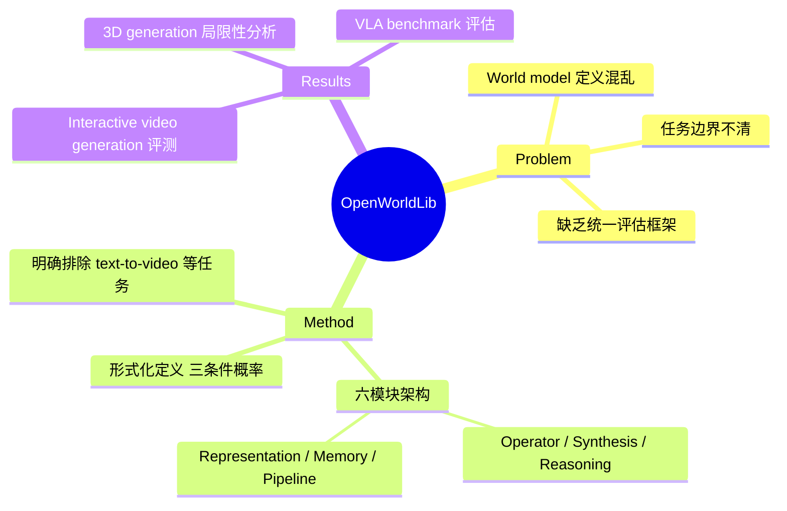

## Summary

OpenWorldLib 提出了一个统一的 world model 定义（以感知为中心、具备交互和长期记忆能力的复杂世界理解与预测框架），并基于此构建了涵盖 interactive video generation、3D generation、multimodal reasoning 和 VLA 的统一推理代码库。

## Problem & Motivation

尽管 world model 研究热度高涨，该领域对"什么是 world model"缺乏共识——不同工作将 text-to-video generation、code generation 等差异很大的任务都归入 world model 范畴，导致定义混乱、方法间难以公平比较。随着 AI 系统从虚拟环境走向现实世界，亟需一个明确的定义边界和统一的评估框架来推进 world model 研究。

## Method

**核心定义**：作者将 world model 形式化为三个条件概率分布——状态转移 p(s_{t+1}|s_t, a_t)、观测模型 p(o_t|s_t) 和奖励模型 p(r_t|s_t, a_t)，但强调仅满足形式并不足够，核心要求是通过多模态感知理解复杂物理动态。

**框架由六个模块组成**：

1. **Operator Module**：输入验证和预处理，将原始信号转为标准化 tensor 表示，通过基类继承提供跨任务统一 API
2. **Synthesis Module**：跨模态生成，包括 visual synthesis（diffusion/flow models）、audio synthesis、VLA signal generation
3. **Reasoning Module**：结构化理解能力，覆盖 general reasoning（MLLM）、spatial reasoning（3D 理解）、audio reasoning
4. **Representation Module**：感知与仿真的桥梁，包括 3D reconstruction（点云、深度图、相机位姿）和 simulation 环境支持
5. **Memory Module**：管理多模态交互历史，支持 context retrieval、state updating 和 session 隔离
6. **Pipeline Module**：统一调度，提供 `from_pretrained()` 加载、`__call__()` 单轮推理、`stream()` 多轮交互接口

**明确排除的任务**：text-to-video generation（如 Sora）、code generation、avatar video generation——作者认为这些缺乏"复杂感知输入"或与物理世界理解无实质关联。

## Key Results

论文主要贡献是框架和定义，实验部分为各子任务的 benchmark 评测综述：

- **Interactive video generation**：Hunyuan-WorldPlay 整体视觉效果最优；Cosmos 在复杂交互操作和物理真实感上优于 WoW；早期方法如 Matrix-Game-2 速度快但长程生成有色彩偏移
- **3D generation**：VGGT 和 InfiniteVGGT 支持多视角场景生成，但在大幅相机运动下存在几何不一致和纹理模糊；FlashWorld 生成速度快但在几何稳定性与细节之间难以平衡
- **VLA**：在 AI2-THOR 和 LIBERO 两个仿真环境上评估 π₀、π₀.₅、LingBot-VA 等方法

## Strengths & Weaknesses

**Strengths**:
- 对 world model 给出了相对严谨的定义和边界划分，明确排除了被过度泛化的任务类型，有助于社区形成共识
- 模块化设计合理，六个模块覆盖了 world model 所需的核心能力（感知、生成、推理、记忆、交互）
- 开源代码库提供统一接口，降低了不同方法间对比的工程门槛
- 对未来方向的讨论有洞察力——尤其是关于 token-based Transformer 架构与 frame-based prediction 之间的硬件层面 mismatch

**Weaknesses**:
- 定义的排除标准存在争议：text-to-video 是否真的不属于 world model 取决于模型是否学到了物理规律，不能简单以"缺乏复杂感知输入"为由一刀切
- 实验部分更像 survey 而非严格的 controlled experiment，缺少在统一设定下的公平对比数据
- 框架目前仅覆盖推理（inference），不涉及训练，实际对研究推进的帮助有限
- 作者机构信息不够透明（仅标注 DataFlow Team），难以评估团队的领域深度

## Mind Map

## Notes

- 这篇论文的核心价值在于"定义"而非"方法"。对 world model 的定义是否被社区接受将决定其影响力
- 排除 Sora 类 text-to-video 的立场值得关注——如果 video generation model 确实学到了 intuitive physics，按作者的定义它应该属于 world model，矛盾之处在于作者过度依赖"是否有 action conditioning"作为判据
- 硬件层面 token vs. frame 的讨论是一个好观点，但论文未深入展开具体解决路径
