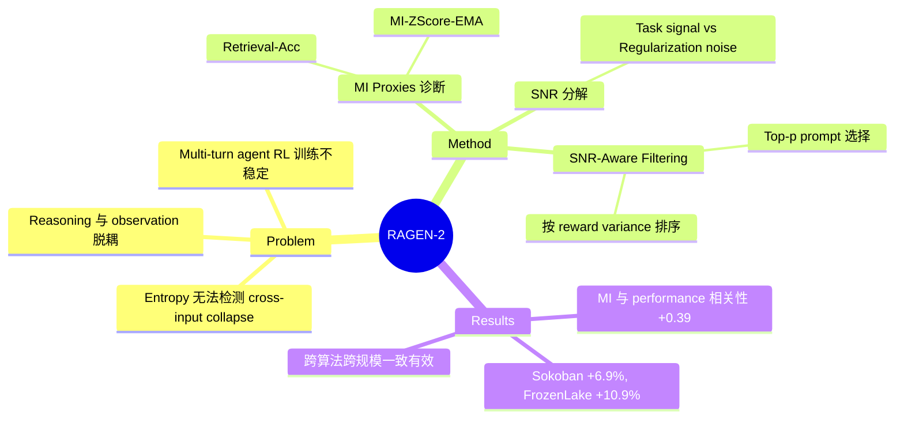

## Summary

提出 Reasoning Collapse 现象——multi-turn LLM agent 在 RL 训练中产生与输入无关的固定 thinking pattern，并引入基于 mutual information 的诊断指标和 SNR-Aware Filtering 缓解策略，在多个环境和算法上验证了有效性。

## Problem & Motivation

Multi-turn LLM agent 的 RL 训练本质上不稳定，reasoning 质量直接决定任务表现。现有方法普遍用 entropy 来监测 reasoning 稳定性，但 entropy 只衡量同一输入下的多样性（H(Z|X)），无法检测 reasoning 是否真正响应不同 context。论文揭示了一种隐蔽的失败模式：agent 的 reasoning trace 在单个输入内看似多样，但跨输入时趋于一致——即 thinking pattern 与实际环境反馈脱耦。这意味着 entropy 可能给出 false sense of security，而 agent 实际上已经退化为模板化推理。

## Method

**1. 诊断框架：Mutual Information Proxies**

核心思路是用 mutual information I(X;Z) 替代 entropy H(Z|X) 作为 reasoning 健康度指标。具体提出两个 proxy：
- **Retrieval-Acc**：离散指标，衡量 reasoning trace 能否被正确匹配回其源输入
- **MI-ZScore-EMA**：连续指标，比较 matched（真实 input-reasoning 对）与 marginal（随机配对）的 log-likelihood 差异，用 EMA 平滑

实现上采用 in-batch cross-scoring：对 P 个 prompt 各 G 个 sample，计算 scoring matrix L_{i,k,j} = log p_θ(Z_{i,k}|X_j)，无需外部模型即可估计 MI。

**2. SNR 分解与因果分析**

将 policy gradient 分解为三个成分：
- Task signal：prompt 内 reward 差异驱动的梯度
- Task noise：采样/环境随机性
- Regularization noise：KL 和 entropy 正则化（对所有 prompt 均匀施加）

关键发现：当 reward variance 低时，task signal 减弱而 regularization noise 不变，导致 I(X;Z)→0 但 entropy 可维持——这就是 reasoning collapse 的机制。

**3. SNR-Aware Filtering（缓解策略）**

根据 prompt 内 reward variance Var(R|X) 排序，仅保留 top-p 高方差 prompt 进行梯度更新。直觉是：高 reward variance 的 prompt 包含更强的 task signal，能抵抗 regularization noise 对 MI 的侵蚀。计算开销 <0.1%（需 G≥2 trajectories per prompt）。

> 注：Abstract 中提到的 ContextualDivergence (CD) 和 Reasoning Replay 是对同一思想的早期命名，全文中统一为 MI proxies 和 SNR-Aware Filtering。

## Key Results

- MI 指标与 task performance 的 Spearman 相关性 +0.39，远优于 entropy 指标的 -0.11 ~ -0.14
- SNR-Aware Filtering 在多种算法（PPO, DAPO, GRPO, Dr.GRPO）和模型规模（0.5B-7B）上一致有效
- Sokoban 平均提升 6.9%，FrozenLake 平均提升 10.9%
- 测试环境覆盖 Sokoban、FrozenLake、MetaMathQA、Countdown、SearchQA、WebShop、DeepCoder 共 7 个环境
- Quartile ablation 证明了因果性：仅用最低 variance prompt 训练会单调降低 MI 和 performance
- Reasoning length 在 8 个环境中单调下降，提供了 collapse 的行为层面证据

## Strengths & Weaknesses

**Strengths:**
- **问题定义精准**：区分 within-input diversity（entropy）和 cross-input dependence（MI），揭示了一个被广泛忽视的 failure mode。这是对 agentic RL 训练稳定性理解的实质性推进
- **理论与实证结合**：SNR 分解提供了 reasoning collapse 的因果解释，不仅是现象描述
- **方法极其简洁**：SNR-Aware Filtering 本质是 prompt-level 数据筛选，无需改 reward、架构或算法，完全符合 simple & scalable 的原则
- **验证全面**：跨 4 种 RL 算法、3 个模型规模、7 个环境，说服力强

**Weaknesses:**
- SNR 分解假设 task signal 和 regularization noise 可以干净分离，在复杂 reward landscape 下这个假设可能不成立
- Filtering 依赖 reward variance 作为 signal quality proxy，在 sparse reward 或高噪声 reward 场景下可能失效
- 激进 filtering 可能缩小 exploration 覆盖，存在 exploration-exploitation tradeoff
- 仅关注 single-agent 场景，multi-agent 中 collapse 的传播和缓解是开放问题

**影响**：这篇工作对 agentic RL 社区很有价值——它指出了一个实用且可操作的 failure mode，提供了低成本的诊断工具（MI proxies 可直接集成到训练 pipeline）和简洁的缓解方案。对于正在做 LLM agent RL 训练的人，这篇论文的 insight 可以直接用上。

## Mind Map

## Notes

- 与 RAGEN（v1）的关系：v1 关注 multi-turn agent RL 的基础框架，v2 聚焦训练稳定性诊断
- Reasoning collapse 与 mode collapse 的区别：mode collapse 是输出多样性下降（entropy 可检测），reasoning collapse 是输入依赖性丧失（entropy 检测不到）——这个区分非常 sharp
- SNR-Aware Filtering 的思路可能可以推广到其他 RL fine-tuning 场景（如 RLHF），不仅限于 agentic 设定
- 项目主页：https://ragen-ai.github.io/v2/
