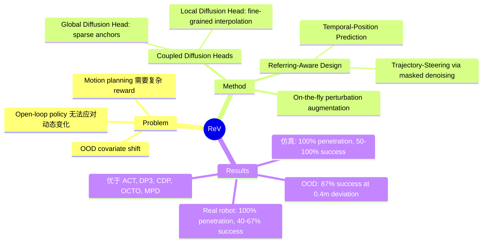

## Summary

ReV 提出了一种 referring-aware 的 closed-loop visuomotor policy，通过 coupled diffusion heads（global + local）生成 coarse-to-fine 轨迹，并利用稀疏 3D referring points 实现实时轨迹重规划，仅需对 expert demonstration 做扰动增强即可训练，无需额外标注或 fine-tuning。

## Problem & Motivation

传统 visuomotor policy 在执行时面临 out-of-distribution 误差和 covariate shift，难以应对动态变化（如新出现的障碍物）。现有方法要么是 open-loop 无法实时调整，要么需要复杂的 reward function 设计。ReV 的核心动机是：如何让 policy 在 closed-loop 执行中接受外部稀疏引导（来自人类或 high-level planner 的 3D referring points），实现实时轨迹重规划，同时保持训练简洁——不需要额外数据采集或 elaborate annotation。

## Method

ReV 的核心架构是 **Coupled Diffusion Heads**，将轨迹生成分为两个层级：

- **Global Diffusion Head (GDH)**：生成稀疏的 action anchors，捕捉长程运动意图
- **Local Diffusion Head (LDH)**：在 anchor 之间插值生成 fine-grained 轨迹段，以 temporal position 为条件

Referring-aware 设计包含两个关键组件：

1. **Temporal-Position Prediction Module**：基于 Transformer encoder 的 N₁-way 分类器，将外部 referring point 分配到轨迹上的合适时间位置
2. **Trajectory-Steering Strategy**：在 diffusion 去噪过程中通过 masked-denoising 注入 referring point 约束，引导轨迹穿过指定空间位置

训练策略上，ReV 采用 on-the-fly augmentation：对 expert demonstration 施加随机扰动生成 referring point，用 categorical cross-entropy loss 训练 temporal-position prediction，同时联合监督 GDH 和 LDH。这种设计巧妙地避免了收集 referring-aware 数据的成本。

## Key Results

**仿真实验（Modified RoboFactory Tasks）**：
- Pick Meat-via: 100% region penetration rate, 91% success rate
- Lift Barrier-via: 100% penetration, 100% success rate
- Place Food-via: 100% penetration, 50% success rate
- Camera Alignment-via: 100% penetration, 92% success rate
- 在所有任务上显著优于 ACT、DP3、CDP、OCTO、MPD 等 baseline

**OOD 泛化性**：在 0.4m deviation 下仍维持 87% success rate

**真实机器人（双臂设置）**：
- Referring point penetration rate 达到 100%
- Success rate 在 12-20/30 trials 之间（物体收集、推动、卡片堆叠、杆抓取、物体交接等任务）

**Ablation**：
- Coupled diffusion heads 在 Adroit、DexArt、MetaWorld、RoboFactory 等 benchmark 上均提升性能
- Learnable LDH 优于 linear interpolation、cubic splines 和 minimum-snap optimization

## Strengths & Weaknesses

**Strengths**：
- 训练策略设计精巧：通过扰动 expert demo 自动生成 referring point 训练数据，避免了额外标注成本，这是工程上非常 practical 的选择
- Coupled diffusion heads 的 coarse-to-fine 分解是合理的 inductive bias，global anchor + local interpolation 天然适合长程操作任务
- Referring-aware 的 closed-loop 设计填补了 visuomotor policy 和 motion planning 之间的空白——既有 learning-based 的泛化能力，又有 planning-based 的可控性
- 仿真中 referring point penetration rate 几乎 100%，说明 trajectory-steering 策略有效

**Weaknesses**：
- 当前仅支持 single referring point，多 referring point 的扩展尚未验证，实际场景中往往需要多个 waypoint 约束
- 真实机器人实验的 success rate（40%-67%）与仿真差距较大，sim-to-real gap 的原因未充分分析
- Place Food-via 任务仅 50% success rate，说明在 precision placement 场景下方法仍有局限
- Referring point 需要外部提供（人类或 high-level planner），但论文未给出与具体 planner 集成的方案
- Institute 信息缺失，无法判断其实验资源和背景

**潜在影响**：ReV 为 visuomotor policy 引入了一种轻量的 human-in-the-loop 干预机制，如果能扩展到多 referring point 并与 VLM planner 集成，可能成为 practical 的 closed-loop manipulation 方案。

## Mind Map

## Notes

- Coupled diffusion heads 的思路与 [[Papers/2410-Pi0]] 的 flow matching action chunking 有相似之处，都是在不同粒度上生成动作序列，但 ReV 更显式地分离了 global intent 和 local execution
- Referring point 作为 human-in-the-loop 的接口很有意思，但更大的价值可能在于与 VLM/LLM planner 的集成——让 high-level reasoning 输出 spatial waypoint 来引导 low-level policy
- Trajectory-steering 中的 masked-denoising 策略值得关注，本质上是在 diffusion 推理时注入 hard constraint，与 classifier-free guidance 的 soft steering 形成对比
