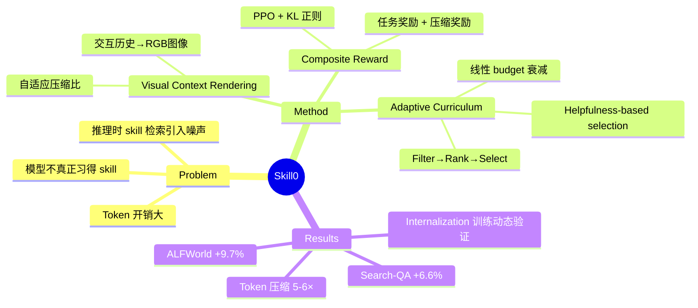

## Summary

提出 Skill0，一个通过 curriculum-based in-context RL 将 skill 从推理时的外部 context 内化为模型参数的框架，在 ALFWorld 和 Search-QA 上分别取得 +9.7 和 +6.6 的提升，同时将每步 token 开销压缩到 <0.5k。

## Problem & Motivation

当前 LLM agent 主流做法是推理时检索 skill 并注入 context，但这带来三个根本问题：1）retrieval noise 引入无关指导；2）注入的 skill 内容占用大量 token，在多轮交互中开销显著；3）模型始终在"跟随"外部指令而非真正"习得"知识。作者类比人类学习过程——从显式指导到内化为自主能力——提出能否通过 RL 系统性地实现这一转变。这个问题重要，因为它直接关系到 agent 的 inference 效率和 zero-shot 泛化能力。

## Method

Skill0 实现 **In-Context Reinforcement Learning (ICRL)**，核心思想是训练时提供 skill context，推理时完全移除。框架包含三个关键组件：

**1. Visual Context Rendering**
- 将交互历史 $h_t$ 和检索到的 skill $S$ 映射为紧凑的 RGB 图像，通过 vision encoder 压缩：$\text{Enc}(h_t, S; c_t)$
- 压缩比 $c_t$ 由 policy 在每步自适应生成，和 task action 一同输出
- 大幅降低 token 开销，同时保留结构化信息

**2. Composite Reward**
- 任务奖励 + 压缩奖励的组合：$\tilde{r}_t = r_t + \lambda \cdot r_t^{comp}$
- 压缩奖励用对数形式 $\ln(c_t)$（仅在任务成功时给予），体现边际递减效应
- PPO-style 优化，带 KL 正则化

**3. Adaptive Curriculum Learning（核心创新）**
- **Phase A（离线）**：按任务类别对 skill 分组，每个 skill $S_k$ 对应验证子任务 $T_k$
- **Phase B（在线）**：分 $N_S$ 个 stage，skill budget 线性衰减：$|S^{(s)}| \leq \lceil N \cdot (N_S - s)/(N_S - 1) \rceil$
- 每隔 $d$ 步在验证集上计算每个 skill 的 **helpfulness** $\Delta_k$（有 skill vs 无 skill 的性能差），仅保留 $\Delta_k > 0$ 的 skill
- Filter → Rank → Select 三步管线：过滤有害 skill，按价值排序，在 budget 内选取
- 最终 stage budget 降为 0，agent 完全无 skill 运行

线性衰减保证相邻 stage 间 context 变化有界（约 $N/(N_S-1)$ 个 skill），避免 PPO 训练不稳定。

## Key Results

**ALFWorld（text-based embodied AI）**：
- 3B 模型：87.9% 平均成功率，比 RL baseline AgentOCR 高 +9.7%，每步仅 0.38k tokens（SkillRL 需 2.21k）
- 7B 模型：89.8% 成功率，比 AgentOCR 81.2% 高 +8.6%

**Search-QA（7 个 QA 数据集）**：
- 3B 模型：40.8% 平均准确率，比 AgentOCR 高 +6.6%
- 7B 模型：44.4%，在 OOD 多跳任务 Bamboogle 上达到 66.9%

**训练动态**：随 curriculum 推进，with-skill 和 without-skill 性能差逐渐缩小，最终趋同——证实 skill 确实从 context 内化到了参数中。

**Ablation**：
- 静态 budget [6,6,6] 移除 skill 后性能骤降 -13.3%；Skill0 的 [6,3,0] 仅 +1.6%
- 移除 ranking/selection → 性能崩溃 -13.7%（随机选 skill 严重干扰学习）
- 移除 filter → -2.7%（context noise）

## Strengths & Weaknesses

**Strengths**：
- **问题定义精准**：skill internalization 是一个清晰且重要的问题，区别于以往只关注推理时 skill augmentation 的工作
- **方法简洁有效**：linear budget decay + helpfulness-based selection 的设计直觉清晰，有理论分析支撑 KL divergence bound
- **实验有说服力**：训练动态图（helpfulness 先升后降）直接验证了 internalization 假说；ablation 充分，拆解了每个组件的贡献
- **实际价值大**：5-6× token 压缩对部署成本意义显著

**Weaknesses**：
- **依赖初始 SkillBank 质量**：skill 来源于 SkillRL，方法本身不解决 skill 的生成/发现问题
- **离线分组需人工干预**：skill-task 的对应关系需要按 domain 手动划分，迁移到新 domain 需重新分组
- **视觉压缩的必要性未充分论证**：将 text context 渲染为 RGB 图像再用 vision encoder 压缩这一设计比较 unconventional，论文未和直接文本压缩方法对比
- **评估 benchmark 相对简单**：ALFWorld 和 Search-QA 的 action space 较小，skill0 在更复杂的 open-ended 环境（如 real web、code generation）中是否同样有效未知
- **scale 不确定**：仅在 3B/7B 上实验，对更大模型是否还需要这种 curriculum 机制未探讨

## Mind Map

## Notes

- 与 SkillRL（同组前作）是配套关系：SkillRL 负责 skill 发现与积累，Skill0 负责 skill 内化。两者组合构成一个完整的 skill lifecycle
- Curriculum learning 中 helpfulness metric 的设计值得借鉴——用 on-policy 验证而非 semantic similarity 来衡量 skill 价值，这比静态检索更能适应学习动态
- 视觉压缩的 idea 有趣但存疑：本质上是用 vision encoder 做 context compression，这与直接做 text summarization 或 learned compression 相比优劣如何？
- 对 GUI agent 领域的启发：当前 GUI agent 也大量依赖推理时的 prompt engineering（task decomposition、few-shot examples），能否用类似的 curriculum RL 将这些"外部知识"内化？
