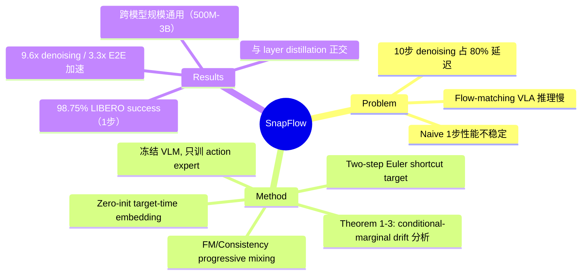

## Summary

Flow-matching VLA（如 [[Papers/2410-Pi0|π0]]、[[Papers/2504-Pi05|π0.5]]）的多步 denoising 占推理延迟的 80%；SnapFlow 通过 progressive self-distillation 将 10 步 ODE 积分压缩为单步前向传播，在 LIBERO 上以 98.75% 成功率匹配甚至超越 10 步 baseline（97.75%），同时实现 9.6x denoising 加速（端到端延迟从 274ms 降至 83ms）。

## Problem & Motivation

Flow-matching VLA 通过迭代 Euler 积分生成 action trajectory，通常需要 10 步 denoising，在 A800 GPU 上耗时约 241ms，占总推理时间的 80%。这一延迟瓶颈在边缘设备上尤为严峻——3Hz 控制频率仅允许约 330ms/cycle。直接将步数降为 1 会导致性能下降（LIBERO 上从 97.75% 降到 96.75%），因为 velocity field 是为多步积分校准的，不适合单步跳跃。现有加速方法（如 Consistency Policy、FlowPolicy）缺乏对 conditional-marginal velocity 差异的理论分析，可能引入 trajectory drift。

## Method

**核心思路**：通过 self-distillation 教会模型在单步内直接从噪声跳到 action，无需外部 teacher 或架构修改。

**1. 理论分析（Theorem 1-3）**：
- Theorem 1 证明 conditional velocity 与 marginal velocity 的差异（covariance Σ_t）几乎处处非零
- Theorem 2 表明用 conditional velocity 训练 fast flow model 会引入正定 variance penalty，导致 trajectory drift
- Theorem 3 分析多步 Euler 积分的累积误差，论证单步 consistency mapping 可以避免误差累积

**2. Corrected Consistency Training**：
- 用 two-step Euler shortcut 构造 target：先用 teacher（stop-gradient 的自身）走半步到 x₀.₅，再取两步的梯形平均作为 target velocity
- 这避免了直接使用 conditional velocity 带来的 drift

**3. Progressive FM/Consistency Mixing**：
- 训练 loss = α·L_FM + (1-α)·λ·L_shortcut，α=0.5，λ=0.1
- FM 分量维持 velocity estimator 质量；consistency 分量教单步跳跃
- 两个目标共同训练，相互支撑

**4. Target-Time Embedding**：
- 新增 zero-initialized 两层 MLP φ_s 编码 target time s，加到 transformer 每个 block 的 time embedding 上
- Zero init 保证训练初始时等价于原始模型，实现 plug-and-play

**5. 训练细节**：冻结 VLM backbone，只训练 action expert + φ_s（约 10% 参数），gradient checkpointing，单卡 A800 约 12 小时 30k steps。

## Key Results

**LIBERO Benchmark（π0.5, 3B）**：
- SnapFlow 1-step：98.75% avg success，MSE 0.0077，CosSim 0.9916，E2E 83ms
- 10-step baseline：97.75% avg success，MSE 0.0117，CosSim 0.9885，E2E 274ms
- Naive 1-step：96.75% avg success，但 per-task variance 大，不稳定
- **Denoising 加速 9.6x，E2E 加速 3.3x**

**SmolVLA（500M）**：MSE 降低 8.3%，CosSim 提升 6.9%，E2E 加速 3.56x。相同超参数直接适用。

**Pareto 分析**：baseline 的 MSE 随步数增加而单调上升（1→10 步增加 30.7%），符合 Theorem 3 关于累积误差的预测。SnapFlow 在 2 步时达到最低 offline MSE（0.00808），但 1 步时 simulation success 最高（98.75%）。

**与其他加速方法正交**：SnapFlow（sampling compression）与 Shallow-π（layer distillation, 2x）正交，理论上可组合到 5-6x E2E 加速，将 π0.5 推至 sub-50ms（20Hz 控制）。

**Ablation**：α=0.5 最优；target-time embedding 去除后 MSE 从 0.0077 升至 0.0098；纯 consistency（α=0）或纯 FM（α=1）均不如混合。

## Strengths & Weaknesses

**Strengths**：
- **理论扎实**：三个定理从根本上解释了为什么 naive 单步失败（conditional-marginal velocity 差异导致 drift），以及为什么多步反而引入累积误差，为方法设计提供了 principled 指导
- **Plug-and-play**：zero-init embedding + 冻结 backbone 设计使得方法可以直接应用于任何 flow-matching VLA，无需改架构
- **训练成本极低**：单卡 12 小时，只训约 10% 参数，实用性强
- **结果反直觉但有说服力**：1 步不仅不输于 10 步，反而更好（98.75% vs 97.75%），且有 Theorem 3 的理论解释
- **正交性分析**：明确了与 layer distillation 的正交关系，指出组合路径

**Weaknesses**：
- **评估局限性**：仅在 LIBERO simulation 上验证，每个 task 仅 10 episodes（10pp 分辨率），98.75% vs 97.75% 的差异在统计上不一定显著。缺乏 real-robot 验证
- **Benchmark 单一**：仅用 LIBERO，未验证其他 simulation benchmark（如 RLBench、MetaWorld）或更复杂的长 horizon 任务
- **SmolVLA 验证不完整**：SmolVLA 只报告了 offline metrics（MSE/CosSim），没有 simulation success rate
- **理论与实践的 gap**：Theorem 1-3 分析的是理想情况，实际 shortcut target 用的是 trapezoidal approximation，近似误差未量化

**影响**：对 flow-matching VLA 的部署有直接价值。如果 real-robot 结果也成立，可以显著降低 VLA 的控制延迟，使得高频控制（10-20Hz）成为可能。与 layer distillation 的正交组合是一个很有前景的方向。

## Mind Map

## Notes

- 与 [[Papers/2410-Pi0|π0]]、[[Papers/2504-Pi05|π0.5]]、[[Papers/2506-SmolVLA|SmolVLA]] 直接相关，是这些模型的加速方案
- 核心 insight：多步 Euler 积分的累积误差 > 单步跳跃的近似误差，这与 image generation 领域的经验相反（图像生成通常多步更好），值得关注这个差异是否源于 action space 的低维性和平滑性
- VLM prefix（60ms）在压缩后成为新瓶颈（占 72%），后续工作可能会转向 VLM 端加速
- 与 Consistency Policy（Prasad et al.）的区别在于：SnapFlow 有 corrected consistency objective 避免 drift，且直接在大规模 VLA 上验证（3B vs 通常的小 policy network）
