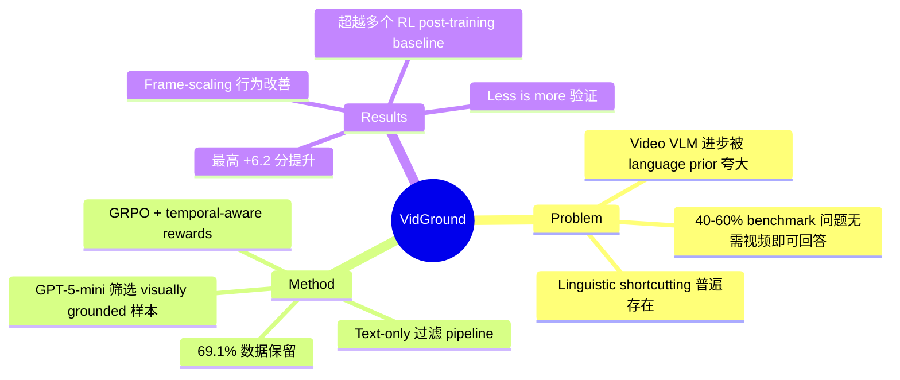

## Summary

揭示 video understanding benchmark 中 40-60% 的问题可仅凭文本线索回答，提出 VidGround 数据过滤方法，仅保留真正需要视觉信息的训练样本，结合 RL post-training 在使用 69.1% 数据的情况下实现最高 6.2 分的提升。

## Problem & Motivation

尽管 VLM 在多模态理解上进展迅速，video understanding 仍显著落后。更关键的是，作者发现主流 benchmark（VideoMME、VideoMMMU、MMVU）中 40-60% 的问题可以仅通过文本（问题+选项）回答，无需观看视频。这意味着现有模型的"进步"很大程度上来自 language prior 而非真正的视觉理解能力。这一 linguistic shortcutting 问题同时存在于评估 benchmark 和 post-training 数据中，导致无法准确衡量视觉理解的真实进展。

## Method

VidGround 的核心是一个简洁的数据过滤 pipeline：

1. **Text-only 评估**：用 GPT-5-mini 仅输入问题文本和选项（不提供视频），测试能否正确回答
2. **保留 visually grounded 问题**：只保留模型无法仅凭文本回答的样本
3. **过滤结果**：从 Video-R1-260K 数据集中筛选出 181,710 个样本（69.1%）

作者识别了四类 text-only 可回答的问题：textual shortcuts（表面文本线索）、external knowledge（常识即可回答）、inferential strategies（逻辑排除）、hallucinated content（模型想象出合理场景）。

多模型验证表明过滤的鲁棒性：85% 被选中的问题在 Qwen2.5-VL-7B text-only 模式下同样无法回答，Gemini-3.1-Pro 的 circular evaluation 显示 97% 一致性。

RL post-training 部分采用 GRPO（Group Relative Policy Optimization），结合 DAPO 的技巧和 temporal-aware rewards，使用 asymmetric clipping 和 KL regularization。

## Key Results

在 VideoMME、VideoMMMU、MMVU 三个 benchmark 上的主要结果：

- **16 frames**：平均 +4.8 分提升
- **32 frames**：平均 +4.6 分提升
- **64 frames**：平均 +6.2 分提升（最佳）

关键发现：
- **Less is more**：181K visually grounded 样本在所有 frame 设置下均优于完整 263K 数据集
- **Frame-scaling 行为差异**：VidGround 训练的模型随 frame 数增加稳步提升（56.8→58.5→59.5），而 full data GRPO 停滞甚至下降（52.0→53.9→53.3），说明 VG 训练使模型真正学会利用时序信息
- 在仅评估 visually grounded 问题时，VidGround 仍有 3.5-5.0 分提升，证实是真正的视觉理解提升
- 超越 LongVILA-R1、TW-GRPO、Video-RTS、Video-R1 等多个 baseline

## Strengths & Weaknesses

**Strengths：**
- 核心 insight 简洁有力：data quality > data quantity，且给出了量化证据。这符合 "simple, scalable, generalizable" 的原则
- 问题诊断深刻：40-60% benchmark 问题可 text-only 回答这一发现本身就是重要贡献，对整个 video VLM 社区的评估方式提出挑战
- Frame-scaling 行为对比是最有信息量的 ablation——说明过滤后模型确实在学习视觉而非语言 shortcut
- 方法极其简单可复现，不依赖复杂架构

**Weaknesses：**
- 过滤依赖单一模型（GPT-5-mini）的 text-only 能力，虽有多模型验证但仍可能引入 model-specific bias
- Asymmetric clipping ablation 显示影响极小，说明 RL 算法选择并非关键——那 GRPO 相比简单 SFT on filtered data 的增量有多大？这个对比缺失
- 未深入分析 failure case：过滤后模型在哪些类型的视觉问题上仍然失败？
- 方法本质是 data selection，泛化到其他数据集/任务的效果未验证

**影响：**
- 对 video VLM post-training 领域有直接指导意义：先过滤再训练应成为标准实践
- 更深层的启示：benchmark contamination by language bias 可能是整个多模态领域被低估的系统性问题

## Mind Map

## Notes

- 与 [[Papers/2604-DAERT]] 形成有趣互补：DAERT 揭示 VLA 的 linguistic fragility，VidGround 揭示 video VLM 评估的 linguistic shortcutting——都指向同一个根本问题：模型过度依赖语言 prior
- 核心问题值得追问：如果 text-only 过滤如此有效，那是否意味着现有 video post-training 数据集的构建方式根本就有问题？应该从数据构建源头避免 text-answerable 问题
- 缺失的对比：VidGround filtered data + SFT vs VidGround filtered data + GRPO，这能分离出 data curation 和 RL 各自的贡献
