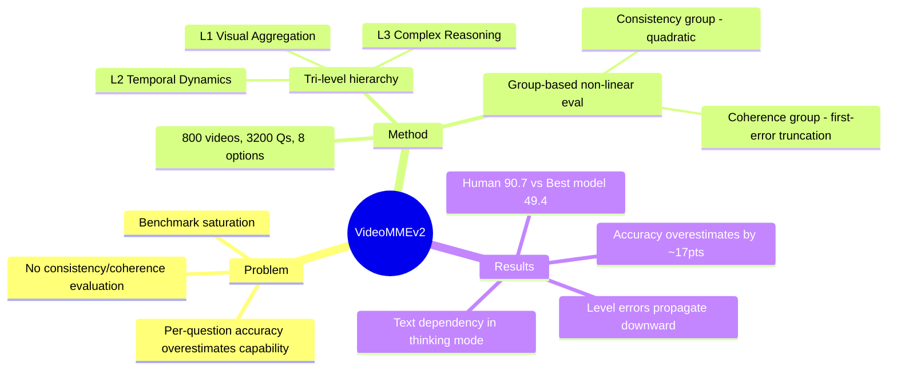

## Summary

Video-MME-v2 提出了一个面向视频理解的新一代 benchmark，通过 progressive tri-level capability hierarchy 和 group-based non-linear evaluation 两大创新，揭示了当前 Video LLM 在一致性推理上的严重不足——最强模型 Gemini-3-Pro 仅 49.4 分（人类 90.7），传统 per-question accuracy 严重高估了模型真实能力。

## Problem & Motivation

现有视频理解 benchmark 面临饱和问题，leaderboard 上的高分与模型真实能力之间存在严重脱节。传统 per-question accuracy 无法检测碎片化或猜测性的正确模式，不能评估模型的一致性推理能力。此外，现有 benchmark 缺乏对能力层级的系统化评估——从基础感知到时序建模再到复杂推理之间的依赖关系被忽视。这导致研究者对模型能力的判断产生误导。

## Method

### Progressive Tri-Level Hierarchy

构建三层递进的能力评估框架：
- **Level 1 - Visual Information Aggregation**：基础感知能力，包括物体识别、跨模态一致性、计数等，不依赖时序信息
- **Level 2 - Temporal Dynamics**：动作识别、时序排列、因果推理，涉及事件的时间演化
- **Level 3 - Complex Reasoning**：叙事理解、社会动态分析、物理世界推理，需要专业知识和 multi-hop inference

### Group-Based Non-Linear Evaluation

设计两类 question group 来超越传统 per-question 评估：
- **Consistency Group**：评估广度，同一视频的相关问题从不同粒度考察同一能力（如从物体定位到运动推理），采用二次评分 (N/4)^2 惩罚孤立正确
- **Coherence Group**：评估深度，问题链式递进模拟逻辑推理步骤，采用 first-error truncation——只计最长连续正确序列，错误后的正确答案不得分

### 数据构建

- 800 个视频、3,200 道题目，8 选项（随机基线 12.5%）
- 超过 80% 视频发布于 2025 年后，近 40% 在 2025 年 10 月之后，降低 pretraining contamination
- 31 个子类别覆盖 Sports、Lifestyle、Art、Education 四大领域
- 严格质控：text-only baseline 过滤、三轮独立交叉验证、50 名外部盲测员、adversarial distractor 设计
- 投入 3,300 人时，12 名标注员 + 50 名审核员

## Key Results

- **人类 vs 模型差距巨大**：人类专家 90.7 分，最强模型 Gemini-3-Pro 仅 49.4 分（non-linear score），差距超过 40 分
- **传统指标严重高估能力**：Gemini-3-Pro 的 average accuracy 为 66.1%，但 non-linear score 仅 49.4，robustness ratio 约 70%；弱模型如 LLaVA-Video-7B 的 ratio 仅 40%
- **商业模型显著领先**：Gemini-3-Pro (49.4) > Doubao-Seed-2.0-Pro (43.3) > GPT-5 (37.0)；开源最强 Qwen3.5-397B-A17B-Think 为 39.1
- **层级瓶颈效应**：Level 1 的感知错误会传播到 Level 2 和 Level 3，所有模型在三个层级上呈单调下降
- **文本依赖严重**：thinking mode 在有字幕时提升 +3.8~+5.8 分，但无字幕时反而退化，说明当前模型仍过度依赖语言推理
- **音频信息有价值**：原生音频输入为 Gemini-3-Pro 带来 +11.2 分提升
- **薄弱维度**：Action & Motion 和 Physical World Reasoning 维度表现最差（低于 30%）

## Strengths & Weaknesses

**Strengths:**
- Non-linear evaluation 是一个重要的方法论贡献——传统 per-question accuracy 确实无法区分"真正理解"和"碎片化猜对"，consistency/coherence group 的设计直击要害
- 8 选项设计（12.5% 随机基线）配合 adversarial distractor 大幅提高了猜测难度
- 数据新鲜度高（80%+ 来自 2025 年后），有效控制 data contamination
- 质控流程扎实：text-only baseline + 多轮交叉验证 + 盲测，标注质量有保障
- 揭示了层级瓶颈效应（Level 1 错误传播）和文本依赖问题，这些 insight 对模型改进有直接指导意义

**Weaknesses:**
- 800 视频 / 3,200 题的规模相对有限，部分子类别的样本量可能不足以支撑可靠统计结论
- Institute 信息未明确披露，难以判断团队背景和潜在利益关系
- 商业模型使用压缩帧输入（Gemini 60M 分辨率、GPT-5 仅 50 帧），这与原生视频输入的对比不完全公平
- Non-linear scoring 的具体参数选择（如 consistency group 的二次函数、coherence group 的 first-error truncation）缺乏理论论证——为什么是二次而不是其他非线性函数？
- 缺少与 Video-MME v1 的详细对比分析，未明确说明 v2 在哪些维度上超越前代

**Impact:**
作为 Video-MME 的后继，这个 benchmark 有望成为评估 Video LLM 的新标准。其核心贡献不仅是数据集本身，更是 evaluation methodology 的革新——group-based non-linear scoring 可以推广到其他多模态 benchmark。当前 40+ 分的人机差距表明视频理解仍有巨大改进空间。

## Mind Map

## Notes

