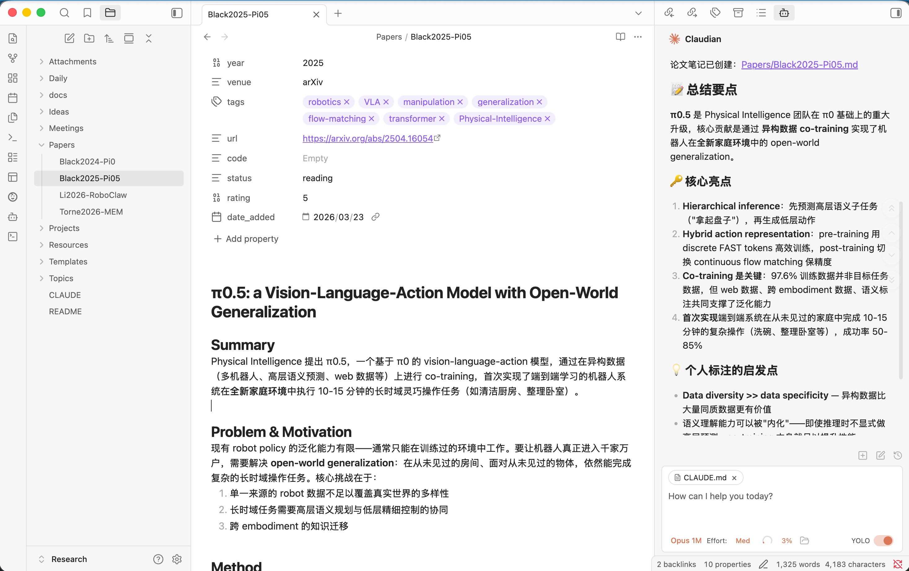

# 🔬 Research Workspace

An Obsidian-based knowledge management workspace for AI research, with AI-assisted paper reading workflow.

基于 Obsidian 的 AI 研究知识管理工作区，支持 AI 辅助论文阅读。



## ✨ Features

- **Paper Notes** — 结构化论文笔记模板（含 Mermaid Mind Map）
- **Research Ideas** — 灵感记录，双向链接到相关论文
- **Project Tracking** — 研究项目进展追踪
- **Literature Survey** — 按主题整理多篇论文对比
- **Meeting Notes** — 会议/讨论记录
- **AI Workflow** — 用 Claude Code 或其他 AI 工具自动生成论文笔记

## 🚀 Getting Started

1. Clone this repo and open it as an Obsidian vault
2. Obsidian settings are pre-configured (templates, attachments, link format)
3. Start creating notes using templates: `Ctrl/Cmd + P` → "Templates: Insert template"

### Prerequisites

- [Obsidian](https://obsidian.md/) (free)
- [Claude Code](https://claude.ai/code) (optional, for AI-assisted paper reading)

## 📁 Structure

| Folder | Purpose | Naming |
|--------|---------|--------|
| `Papers/` | 论文笔记 | `AuthorYear-ShortTitle.md` |
| `Ideas/` | 研究灵感 | 自由命名 |
| `Projects/` | 项目追踪 | 项目名称 |
| `Topics/` | 主题综述 | 主题名称 |
| `Meetings/` | 会议记录 | `YYYY-MM-DD-Description.md` |
| `Daily/` | 每日日志 | `YYYY-MM-DD.md` |
| `Templates/` | Obsidian 模板 | — |
| `Attachments/` | 附件 | — |
| `Resources/` | AI Prompts 等参考资料 | — |

## 📝 Templates

| Template | Purpose |
|----------|---------|
| Paper | 论文笔记（含 YAML frontmatter、Mind Map、Connections） |
| Idea | 研究灵感（status: raw → developing → validated → archived） |
| Project | 项目追踪（status: planning → active → paused → completed） |
| Topic | 主题综述/文献对比（含论文对比表格） |
| Meeting | 会议记录（含 Action Items） |
| Daily | 每日研究日志 |

## 🤖 AI-Assisted Paper Reading

### With Claude Code (recommended)

Tell Claude Code a paper name or link, it will automatically fetch, summarize, and save structured notes:

```
总结论文 pi0
```

Claude Code will:
1. Fetch paper content via web search / URL
2. Generate notes following the Paper template
3. Save to `Papers/AuthorYear-ShortTitle.md`

### With other AI tools

Copy the prompt from [Resources/AI-Prompts.md](Resources/AI-Prompts.md), paste it along with the paper info into any AI chat, then paste the output into Obsidian.

## 🏷️ Tags

Flat tags using canonical English terms:

- **Domain**: `LLM`, `CV`, `RL`, `multimodal`, `diffusion`
- **Method**: `transformer`, `RLHF`, `distillation`, `RAG`
- **Venue** (optional): `NeurIPS`, `ICML`, `ICLR`, `ACL`, `CVPR`
- **Task**: `text-generation`, `image-classification`, `alignment`

## 🔗 Linking Strategy

Notes are connected via `[[wikilinks]]` to form a knowledge graph:

- Paper ↔ Paper (related work)
- Idea → Paper (inspiration source)
- Project → Paper + Idea (foundations)
- Topic → Papers (literature survey)
- Meeting → Project / Paper (follow-ups)

Use Obsidian's **Graph View** to visualize your research knowledge network.

## 🌟 Star History

[](https://star-history.com/#liqing-ustc/Research&Date)

If you find this useful, please give it a star 🌟! It helps others discover this project.

**Author**: [Qing Li](https://liqing.io/)

## 📄 License

Feel free to use this as a template for your own research workspace.
