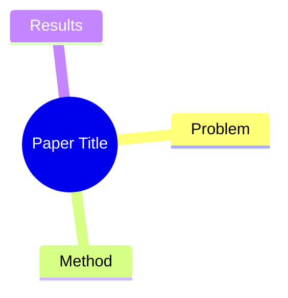

---
title:
authors: [author1, author2, ...]
institute: [institute1, institute2, ...]
date_publish:
venue:
tags: [tag1, tag2, ...]
url:
code:
rating: "%% 1=不相关, 2=了解即可, 3=有参考价值, 4=重要, 5=必读 %%"
date_added: "{{date}}"
---
## Summary
%% 一句话概括：解决了什么问题、怎么解决的 %%

## Problem & Motivation
%% 问题背景与动机，2-5 句话。为什么重要？现有方法有什么局限？ %%

## Method
%% 核心方法/架构。中文撰写，保留英文技术术语。可分段，鼓励列出关键组件。 %%

## Key Results
%% 主要实验结果，包含具体数字和 benchmark 名称。 %%

## Strengths & Weaknesses
%% 方法亮点与局限的个人评价，以及对领域的潜在影响。 %%

## Mind Map
%% root 节点用论文 ShortTitle，子节点覆盖 Problem / Method / Results 三个维度 %%

## Notes
%% 其他想法、疑问、启发。留空供后续填写。 %%
