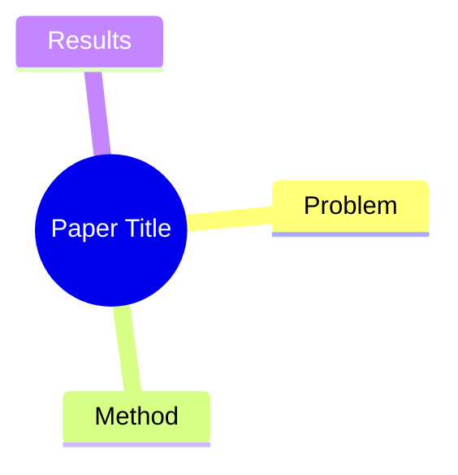

---
title:
authors: []
year:
venue:          # e.g. NeurIPS 2025, arXiv
tags: []        # e.g. [transformer, LLM, RLHF]
arxiv:          # arXiv ID, e.g. 2301.12345
url:            # 论文链接
code:           # GitHub repo 链接
status: unread  # unread / reading / finished
rating:         # 1-5 整数（1=一般, 3=不错, 5=必读）
date_added: "{{date}}"
---

## Summary
一句话概括这篇论文解决了什么问题、怎么解决的。

## Problem & Motivation
作者要解决什么问题？为什么重要？

## Method
核心方法/架构描述。

## Key Results
主要实验结果和 takeaway。

## Strengths & Weaknesses
个人评价。

## Mind Map

## Connections
- Related papers:
- Related ideas:
- Related projects:

## Notes
其他想法、疑问、启发。
