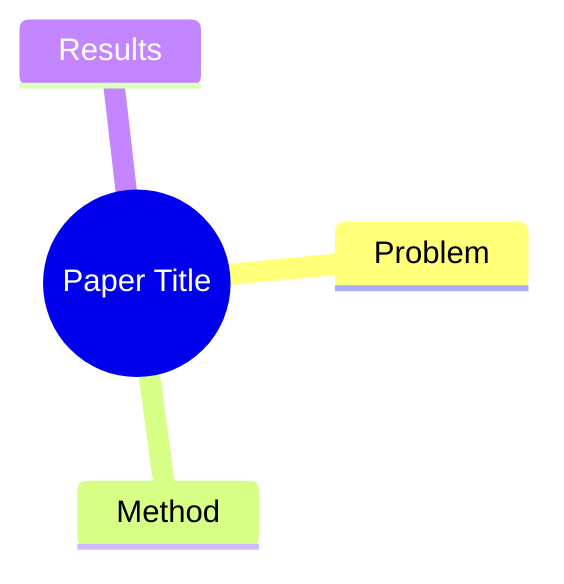

# Research Workspace Implementation Plan

> **For agentic workers:** REQUIRED SUB-SKILL: Use superpowers:subagent-driven-development (recommended) or superpowers:executing-plans to implement this plan task-by-task. Steps use checkbox (`- [ ]`) syntax for tracking.

**Goal:** Create a fully functional Obsidian research workspace with folders, templates, AI prompts, and README.

**Architecture:** Flat file creation — folders, markdown templates, and a README. No code logic. Obsidian settings are configured via JSON files in `.obsidian/`.

**Tech Stack:** Markdown, YAML frontmatter, Mermaid (mindmap), Obsidian core Templates plugin.

**Spec:** `docs/superpowers/specs/2026-03-23-research-workspace-design.md`

---

### Task 1: Create folder structure

**Files:**
- Create: `Papers/.gitkeep`
- Create: `Ideas/.gitkeep`
- Create: `Projects/.gitkeep`
- Create: `Topics/.gitkeep`
- Create: `Meetings/.gitkeep`
- Create: `Templates/` (will be populated in Task 2)
- Create: `Attachments/.gitkeep`
- Create: `Resources/` (will be populated in Task 4)
- Create: `Daily/.gitkeep`

- [ ] **Step 1: Create all directories with .gitkeep files**

```bash
mkdir -p Papers Ideas Projects Topics Meetings Templates Attachments Resources Daily
touch Papers/.gitkeep Ideas/.gitkeep Projects/.gitkeep Topics/.gitkeep Meetings/.gitkeep Attachments/.gitkeep Daily/.gitkeep
```

- [ ] **Step 2: Verify directories exist**

```bash
ls -d Papers Ideas Projects Topics Meetings Templates Attachments Resources Daily
```

Expected: all 9 directories listed.

- [ ] **Step 3: Commit**

```bash
git add Papers Ideas Projects Topics Meetings Attachments Resources Daily
git commit -m "feat: create workspace folder structure"
```

---

### Task 2: Create templates

**Files:**
- Create: `Templates/Paper.md`
- Create: `Templates/Idea.md`
- Create: `Templates/Project.md`
- Create: `Templates/Topic.md`
- Create: `Templates/Meeting.md`
- Create: `Templates/Daily.md`

- [ ] **Step 1: Create `Templates/Paper.md`**

Write the following content exactly:

```markdown
---
title:
authors: []
year:
venue:          # e.g. NeurIPS 2025, arXiv
tags: []        # e.g. [transformer, LLM, RLHF]
arxiv:          # arXiv ID, e.g. 2301.12345
url:            # 论文链接
code:           # GitHub repo 链接
status: unread  # unread / reading / finished
rating:         # 1-5 整数（1=一般, 3=不错, 5=必读）
date_added: "{{date}}"
---

## Summary
一句话概括这篇论文解决了什么问题、怎么解决的。

## Problem & Motivation
作者要解决什么问题？为什么重要？

## Method
核心方法/架构描述。

## Key Results
主要实验结果和 takeaway。

## Strengths & Weaknesses
个人评价。

## Mind Map


## Connections
- Related papers:
- Related ideas:
- Related projects:

## Notes
其他想法、疑问、启发。
```

- [ ] **Step 2: Create `Templates/Idea.md`**

```markdown
---
title:
tags: []
status: raw     # raw / developing / validated / archived
date_created: "{{date}}"
---

## Core Idea
一句话描述这个 idea。

## Motivation
为什么觉得这个方向值得做？

## Related Work
- [[]]  — 链接到相关论文笔记

## Rough Plan
初步的实现思路或实验设计。

## Open Questions
还没想清楚的问题。
```

- [ ] **Step 3: Create `Templates/Project.md`**

```markdown
---
title:
tags: []
status: planning  # planning / active / paused / completed
date_started: "{{date}}"
---

## Goal
这个项目要达成什么？

## Papers
- [[]]  — 核心参考论文

## Ideas
- [[]]  — 关联的 idea

## Progress Log
- {{date}}:

## TODOs
- [ ]

## Results & Findings

## Notes
```

- [ ] **Step 4: Create `Templates/Topic.md`**

```markdown
---
title:
tags: []
status: draft   # draft / active / stable
date_updated: "{{date}}"
---

## Overview
这个主题的背景和核心问题。

## Paper Comparison

| Paper | Year | Method | Key Contribution |
|-------|------|--------|-----------------|
| [[]]  |      |        |                 |

## Key Takeaways
主要结论和趋势。

## Open Problems
该领域尚未解决的问题。
```

- [ ] **Step 5: Create `Templates/Meeting.md`**

```markdown
---
title:
date: "{{date}}"
attendees: []
tags: []
---

## Agenda

## Discussion Notes

## Action Items
- [ ]

## Follow-ups
- [[]]  — 链接到相关论文/项目
```

- [ ] **Step 6: Create `Templates/Daily.md`**

```markdown
---
date: "{{date}}"
---

## Focus
今天计划做什么。

## Reading Log
- [[]]  — 今天读了什么

## Quick Notes
随手记录的想法和发现。

## Tomorrow
明天要跟进的事项。
```

- [ ] **Step 7: Verify all 6 templates exist**

```bash
ls Templates/
```

Expected: `Paper.md Idea.md Project.md Topic.md Meeting.md Daily.md`

- [ ] **Step 8: Commit**

```bash
git add Templates/
git commit -m "feat: add all workspace templates (Paper, Idea, Project, Topic, Meeting, Daily)"
```

---

### Task 3: Create AI Prompts reference

**Files:**
- Create: `Resources/AI-Prompts.md`

- [ ] **Step 1: Create `Resources/AI-Prompts.md`**

```markdown
# AI Prompts for Research

## 论文总结 Prompt

请按照以下格式总结这篇论文，用中英混用的风格（专有名词用英文）：

---

## Summary
一句话概括。

## Problem & Motivation
作者要解决什么问题？为什么重要？

## Method
核心方法/架构描述。

## Key Results
主要实验结果和 takeaway。

## Strengths & Weaknesses
你的评价。

## Mind Map
用 mermaid mindmap 语法画出论文的核心结构。

## Connections
可能相关的研究方向或论文。

---

论文信息：[在此粘贴论文标题/链接/关键内容]
```

- [ ] **Step 2: Commit**

```bash
git add Resources/AI-Prompts.md
git commit -m "feat: add AI prompts reference document"
```

---

### Task 4: Configure Obsidian settings

**Files:**
- Modify: `.obsidian/app.json` (or create if not exists)
- Modify: `.obsidian/core-plugins.json` (enable templates)

- [ ] **Step 1: Read current `.obsidian/app.json`**

```bash
cat .obsidian/app.json 2>/dev/null || echo "{}"
```

- [ ] **Step 2: Update `.obsidian/app.json` to set attachment folder and template folder**

Ensure these keys are set (merge with existing):
```json
{
  "attachmentFolderPath": "Attachments",
  "newFileLocation": "current",
  "newLinkFormat": "shortest"
}
```

- [ ] **Step 3: Read current `.obsidian/templates.json`**

```bash
cat .obsidian/templates.json 2>/dev/null || echo "{}"
```

- [ ] **Step 4: Create/update `.obsidian/templates.json`**

```json
{
  "folder": "Templates"
}
```

- [ ] **Step 5: Ensure templates and tag-pane core plugins are enabled**

Read `.obsidian/core-plugins.json`, ensure both `"templates"` and `"tag-pane"` are in the array. If not, add them.

- [ ] **Step 6: Verify settings**

```bash
cat .obsidian/app.json
cat .obsidian/templates.json
```

Expected: attachment path is `Attachments`, template folder is `Templates`.

- [ ] **Step 7: Commit**

```bash
git add .obsidian/app.json .obsidian/templates.json .obsidian/core-plugins.json
git commit -m "feat: configure Obsidian settings (attachments, templates, link format)"
```

---

### Task 5: Create README.md

**Files:**
- Create: `README.md`

- [ ] **Step 1: Create `README.md`**

```markdown
# Research Workspace

AI 研究领域的知识管理工作区，基于 Obsidian。

## Structure

| Folder | Purpose | Naming |
|--------|---------|--------|
| `Papers/` | 论文笔记 | `AuthorYear-ShortTitle.md` |
| `Ideas/` | 研究灵感 | 自由命名 |
| `Projects/` | 项目追踪 | 项目名称 |
| `Topics/` | 主题综述 | 主题名称 |
| `Meetings/` | 会议记录 | `YYYY-MM-DD-Description.md` |
| `Daily/` | 每日日志 | `YYYY-MM-DD.md` |
| `Templates/` | Obsidian 模板 | — |
| `Attachments/` | 附件 | — |
| `Resources/` | AI Prompts 等参考资料 | — |

## Templates

使用 Obsidian 核心 Templates 插件（已配置好，模板文件夹为 `Templates/`）。

新建笔记后，`Ctrl/Cmd + P` → "Templates: Insert template" → 选择对应模板。

| Template | 用途 |
|----------|------|
| Paper | 论文笔记（含 Mind Map） |
| Idea | 研究灵感 |
| Project | 项目追踪 |
| Topic | 主题综述/文献对比 |
| Meeting | 会议记录 |
| Daily | 每日研究日志 |

## Tags

使用术语的通用写法，保持扁平：

- **领域**: `LLM`, `CV`, `RL`, `multimodal`, `diffusion`
- **方法**: `transformer`, `RLHF`, `distillation`, `RAG`
- **会议**（可选）: `NeurIPS`, `ICML`, `ICLR`, `ACL`, `CVPR`
- **任务**: `text-generation`, `image-classification`, `alignment`

## AI Workflow

1. 把论文关键词/链接发给 AI（Claude），附上 [AI-Prompts](Resources/AI-Prompts.md) 里的 prompt
2. AI 按 Paper 模板格式输出笔记
3. 粘贴到 Obsidian，阅读修改
4. 补充 frontmatter 元数据、双向链接和 tags

可通过 Claudian 插件在 Obsidian 内直接使用，或在外部 Claude 对话中使用。
```

- [ ] **Step 2: Verify README renders correctly**

Open `README.md` in Obsidian and check tables and links render properly.

- [ ] **Step 3: Commit**

```bash
git add README.md
git commit -m "feat: add workspace README with structure, templates, and workflow guide"
```

---

### Task 6: Final verification

- [ ] **Step 1: Verify complete folder structure**

```bash
find . -maxdepth 1 -type d | sort
```

Expected directories: Attachments, Daily, Ideas, Meetings, Papers, Projects, Resources, Templates, Topics

- [ ] **Step 2: Verify all templates**

```bash
ls Templates/
```

Expected: 6 template files.

- [ ] **Step 3: Open Obsidian and test creating a note with Paper template**

Manual test: create a new note in `Papers/`, insert Paper template, verify frontmatter and Mind Map section render correctly.

- [ ] **Step 4: Final commit (if any fixes needed)**
